# JAVA1

## JAVA简介

### JAVA的由来

JAVA 最初是由任职于太阳微系统的詹姆斯-高斯林（James-Gosling）等人于1990年代初开发。他最初被命名为Oak；当时发现Oak被其他公司注册了，不得不重新起名，当时他们正在咖啡馆喝着印尼爪哇（JAVA）岛出产的咖啡，有人提议就叫JAVA怎么样，然后他们就把这种程序语言命名为JAVA。1994年网警公司推出了一种叫做Netscape的浏览器，加速了互联网的普及；高斯林他们就开始针对互联网做JAVA 应用，1995年高斯林参加“硅谷-好莱坞”互联网及娱乐业研讨会，演讲的时候高斯林江鼠标移向一个分子模型，这个模型动起来了，而且可以随着鼠标的移动上下翻滚。就这样，JAVA活下来了并且从1995年正式进入人们的视野。

### JAVA的特性：安全  跨平台  虚拟机内运行 多线程

#### 安全

Java 通常被用在网络环境中，为此，Java 提供了一个安全机制以防止恶意代码的攻击。除了 Java 语言具有许多的安全特性以外，Java 还对通过网络下载的类增加一个安全防范机制，分配不同的名字空间以防替代本地的同名类，并包含安全管理机制。

#### 1. 面向对象

Java 是一种面向对象的语言，它对对象中的类、对象、继承、封装、多态、接口、包等均有很好的支持。为了简单起见，Java 只支持类之间的单继承，但是可以使用接口来实现多继承。使用 Java 语言开发程序，需要采用面向对象的思想设计程序和编写代码。

#### 多线程

Java 语言是多线程的，这也是 Java 语言的一大特性，它必须由 Thread 类和它的子类来创建。Java 支持多个线程同时执行，并提供多线程之间的同步机制。任何一个线程都有自己的 run() 方法，要执行的方法就写在 run() 方法体内。

其实，Java 还是一个平台。Java 平台由 Java 虚拟机（Java Virtual Machine，JVM）和 Java 应用编程接口（Application Programming Interface，API）构成。Java 应用编程接口为此提供了一个独立于操作系统的标准接口，可分为基本部分和扩展部分。在硬件或操作系统平台上安装一个 Java 平台之后，Java 应用程序就可运行。

### 运行机制JDK JRE

java程序并非直接运行在系统，而是运行在虚拟运行环境中jvm ，jvm可以在 多个平台运行 包括 Windows mac linux 平台。

JDK 是开发环境包 包括多个开发工具 ：

javac – 编译器，将源程序转成字节码

jar – 打包工具，将相关的类文件打包成一个文件

javadoc – 文档生成器，从源码注释中提取文档

jdb – debugger，查错工具

java – 运行编译后的java程序（.class后缀的）

appletviewer：小程序浏览器，一种执行[HTML文件](https://baike.baidu.com/item/HTML文件?fromModule=lemma_inlink)上的Java小程序的Java浏览器。

Javah：产生可以调用Java过程的C过程，或建立能被Java程序调用的C过程的头文件。

Javap：Java反汇编器，显示编译类文件中的可访问功能和数据，同时显示[字节代码](https://baike.baidu.com/item/字节代码?fromModule=lemma_inlink)含义。

Jconsole: Java进行系统调试和监控的工具

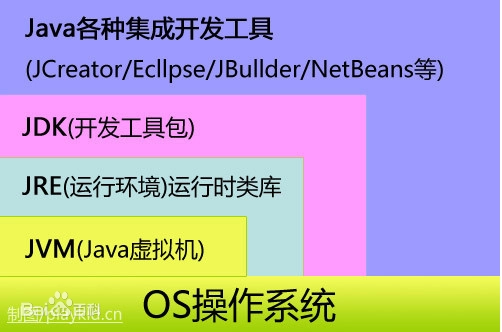

图1-1 jdk结构图

JRE是运行环境，但是不包含开发其他开发工具

### Java语言的特点

Java 语言的风格很像 C 语言和 [C++](http://c.biancheng.net/cplus/) 语言，是一种纯粹的面向对象语言，它继承了 C++ 语言面向对象的技术核心，但是拋弃了 C++ 的一些缺点，比如说容易引起错误的指针以及多继承等，同时也增加了垃圾回收机制，释放掉不被使用的内存空间，解决了管理内存空间的烦恼。

Java 语言是一种分布式的面向对象语言，具有面向对象、平台无关性、简单性、解释执行、多线程、安全性等很多特点，下面针对这些特点进行逐一介绍。

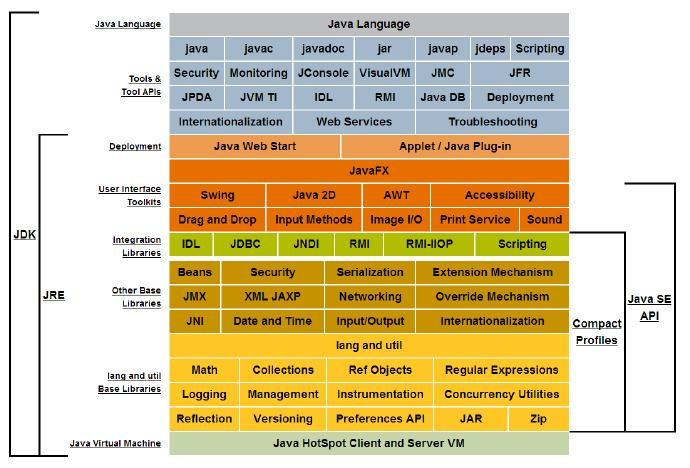

### JAVA运行原理

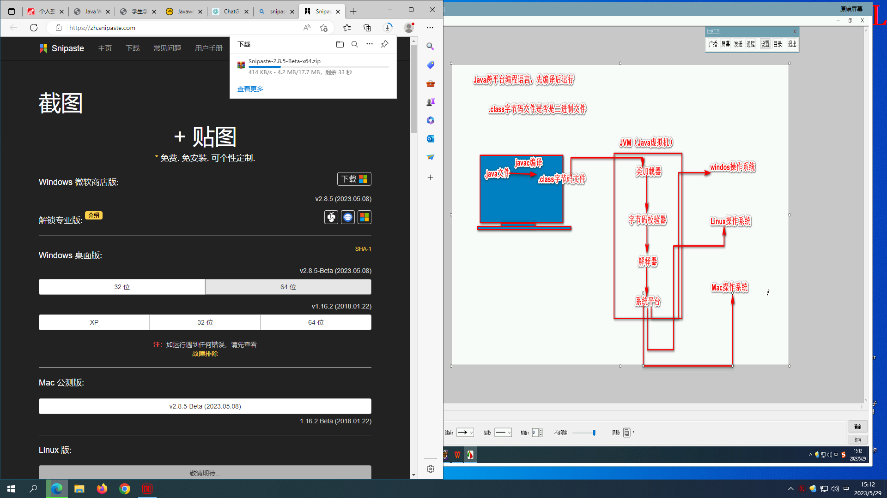

JAVA三种技术架构介绍

按应用范围，Java 可分为 3 个体系，即 Java SE、Java EE 和 Java ME。下面简单介绍这 3 个体系。

1. Java SE

Java SE（Java Platform Standard Edition，Java 平台标准版）以前称为 J2SE，它允许开发和部署在桌面、服务器、嵌入式环境和实时环境中使用的 Java 应用程序。Java SE 包含了支持 Java Web 服务开发的类，并为 Java EE 提供基础，如 Java 语言基础、JDBC 操作、I/O 操作、网络通信以及多线程等技术。图 1 所示为 Java SE 的体系结构。

Java SE的体系结构

图1-2 Java SE

1. Java EE

Java EE（Java Platform Enterprise Edition，Java 平台企业版）以前称为 J2EE。企业版本帮助开发和部署可移植、健壮、可伸缩且安全的服务器端 Java 应用程序。Java EE 是在 Java SE 基础上构建的，它提供 Web 服务、组件模型、管理和通信 API，可以用来实现企业级的面向服务体系结构（Service Oriented Architecture，SOA）和 Web 2.0 应用程序。

1. Java ME

Java ME（Java Platform Micro Edition，Java 平台微型版）以前称为 J2ME，也叫 K-JAVA。 Java ME 为在移动设备和嵌入式设备（比如手机、PDA、电视机顶盒和打印机）上运行的应用程序提供一个健壮且灵活的环境。

Java ME 包括灵活的用户界面、健壮的安全模型、丰富的内置网络协议以及对可以动态下载的联网和离线应用程序。基于 Java ME 规范的应用程序 只需编写一次就可以用于许多设备，而且可以利用每个设备的本机功能。

显示文件扩展名

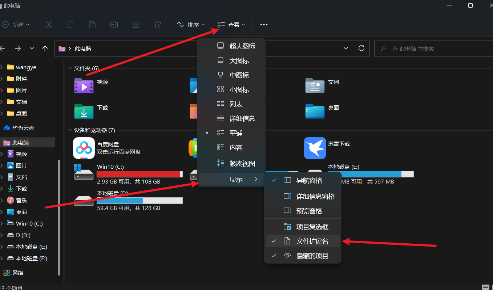

## 编程阶段

#### 创建包

> 创建包的目的是为了方便管理整个工程，包的名字需要独一无二

通用规范

> 此后变成建议遵循阿里的开发手册，让自己编码更好的与别人协同

[e9af0d4111234bfda5813c72a368a168_KgPBTXkd4A.pdf](assets/e9af0d4111234bfda5813c72a368a168_KgPBTXkd4A-20240121141758-a94j7f7.pdf)

- 包名所有字母一律小写。例如：cn.lina%.chapter1..demo01。
- 类名和接口名每个单词的首字母都要大写。例如：ArrayList、Iterator。
- 常量名所有字母都大写，单词之间用下划线连接。例如：DAY_OF_MONTH。
- 变量名和方法名的第一个单词首字母小写，从第二个单词开始每个单词首字母大写。例如：lineNumber、getLineNumber。

⑤在程序中，应该尽量使用有意义的英文单词来定义标识符，使得程序便于阅
读。例如：使用userName表示用户名，password表示密码。

### JAVA层级

包>类>方法

```Java
package cn.hui7.top;

public class autochange {
    public static void main(String[] args) {

    }
}
```

### 初识java代码

> public 是公共，可以使用以下权限。

static  是静态，将该方法加入静态区

void是无返回值

String[] args  main()方法中的字符串数组类型的参数就是java命令的参数，使用java命令的方式运行main()方法，会将java命令的参数入参到Java main()方法的字符串数组参数中。

可以使用命令  java hello asd a s d   自定义一些参数

```Java

//访问修饰符 定义为类 类名
public class asdas {
//  访问修饰符 静态 返回值 主函数入口 （字符串命令）
    public static void main(String[] args) {

    }
}

```

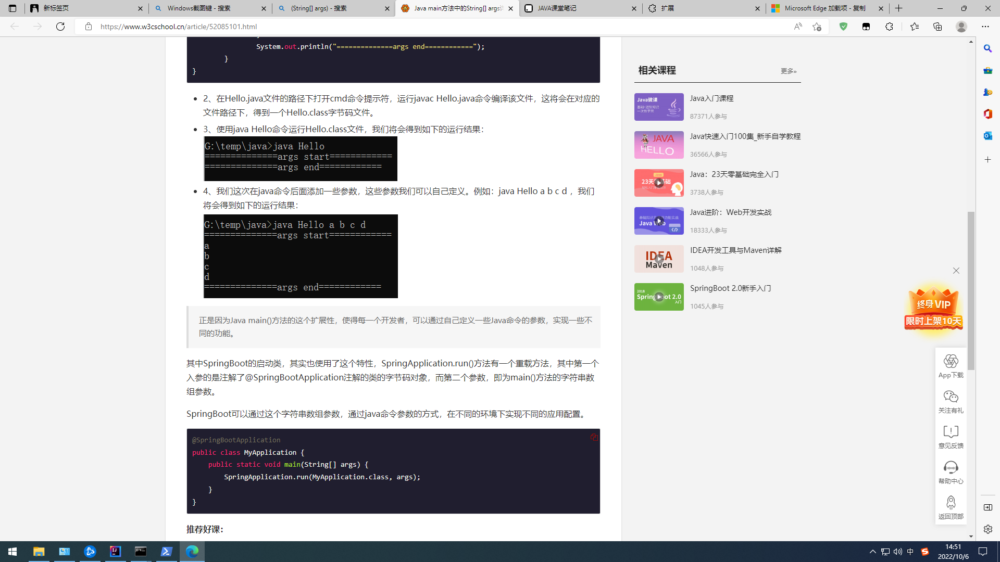

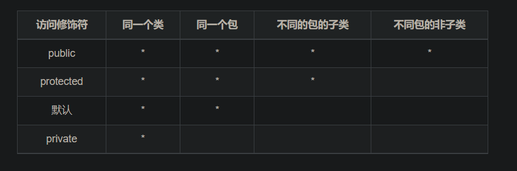

### 访问控制级别

- private 当前类访问级别
- default 包访问级
- protected 子类访问级别
- publice  公共访问级别

### 数据类型

基本数据类型一共有八种，其余类型都是引用类型，每个类型都有默认值，可以声明不赋值然后输出进行查看。

赋值时 “ ” 和 null是不一样。

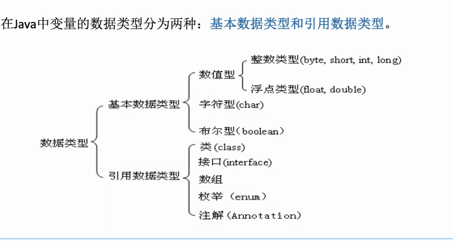

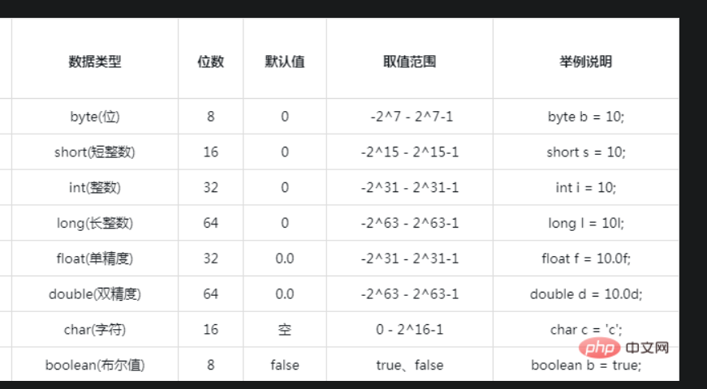

#### 整型

> 可与long 连用让int存储的数值更多

- L表示整型
- F表示浮点型

```Java
int a=10

  long a=10L; 
  float b=13.6F;

```

#### 浮点型

> 一般使用IEEE754 标准 ，S E M 三部分构成浮点数，单双精度区别在于EM 长度

- 单精度 float
- 双精度double

```Java

```

字符型

#### 布尔类型：

布尔型适于逻辑运算，只有true和false两个值，一般用于程序流程控制。
boolean类型占几个字节没有给出精确的定义，取决于虚拟机的实现。

### 引用数据类型

### 变量

> 变量是内存单元，定义的标识符就是变量名，内存中的值就是变量的值

编程中的定义

```Java
int a=6
```

#### 常量的定义

> Java中的符号常量是由final关键字修饰的变量，final关键字决定了该变量
> 只能被赋值一次。

```Java
[修饰符]final数据类型常量名[=字面值常量]；
```

> 加public修饰符，这个包内都可以访问到该常量，static是加入到静态区

```Java
final double PI=3.14564
public static final double PI=3.14456;

```

注意：

#### 基本数据类型所占用的空间

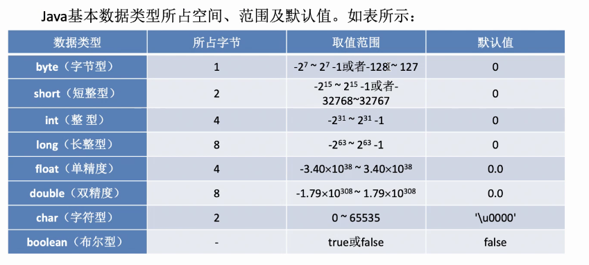

### 成员变量

- **成员变量又分为：实例变量和类变量。**

类变量也叫静态变量，即在变量前加static 的变量；

实例变量也叫对象变量，即没加static 的变量；

区别在于：类变量是所有对象共有，其中一个对象将它值改变，其他对象得到的就是改变后的结果；

而实例变量则为对象私有，某一个对象将其值改变，不影响其他对象；示例：

ring toString() {
return "Name:" + name + ", Age:" + age;
}

```Java

class Person {
    String name;
    static int age;
    
public String toString() {
    return "Name:" + name + ", Age:" + age;
}
    
public static void main(String[] args) {
    Person p1 = new Person();
    p1.name = "zhangsan";
    p1.age = 10;
    Person p2 = new Person();
    p2.name = "lisi";
    p2.age = 12;
    System.out.println(p1);
    System.out.println(p2);
}
    /*
    Name:zhangsan, Age:12
    Name:lisi, Age:12
     */
   //若去掉age前的static，则输出结果为：
   /*
   Name:zhangsan, Age:10
   Name:lisi, Age:12
   */

}
```

- **成员变量的存储：没有实例化的成员变量放在栈中；实例化后的对象放在堆中，栈中放的是指向堆中对象的引用地址。**
- **成员变量在对象被创建时而存在，当对象被GC回收时消失，生存周期适中。**
- **成员变量作用在整个类中（静态方法除外），不能在定义的同时进行初始化，只能通过对象访问。示例：**

```Java
class Person {
    String name;
    public static void main(String[] args) {
        Person p1 = new Person();
        p1.name = "zhangsan";
        System.out.println(p1);
    }

}
```

#### 局部变量

- **局部变量就是方法里定义的变量。**
- **局部变量仅作用在局部区域中，从定义开始到大括号或者return结束，生命周期短。**
- **局部变量存储：基本数据类型变量放在栈中，引用数据类型放在堆中**
- **局部变量可以先定义再初始化，也可以定义的同时初始化，局部变量没有默认初始值。**

```Java

class test{
    public static void main (String args[]) {
        int a;
        System.out.println(a);
        //错误: 可能尚未初始化变量a
    }

}
```

### 数据类型转化

#### 自动类型转化

> 类型范围小的变量，可以直接赋值给类型范围大的变量。

当使用 byte short char是直接转换成int类型参与运算的。

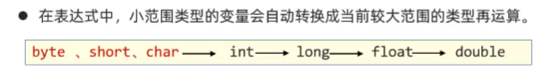

```Java
//当赋值给存储范围更大的变量时会自动转化a的变量类型为int 
byte a = sada;

int b =a;

byte i=50;

byte l=99;
//用int去接收这个类型才对
int cc=i+l
```

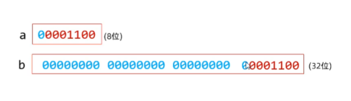

```Java
//字符转数字 ,会将a的ASCII码赋值个int 类型的变量 
char str="a";
int  zz=str;
```

#### 强制类型转化

```Java
//语法
新数据类型 新变量名=（原数据类型）被转变量名
```

> 当把存储范围更大的变量赋值给范围小的变量时，会导致丢失数据，所以会报错，可以使用强制类型转化, 丢失数据只有在原本存储的数据塞满小范围之后才会丢数据或数据错误

丢失小数部分，或添加小数部分（ .0 ）

- 浮点型 ⇌整型
- 字符型 ⇌整形
- 字节型⇌整形

```Java
int a=20;

byte b=(byte)a;

```

强行转化时导致的数据与错误

> 在二进制中只能从后往前存储，并且第一位是符号位。所以输出结果完全错误。

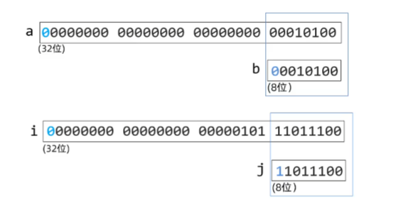

#### 变量数据类型转化

**隐式转化**

一、 隐式转换也叫自动类型转换，指的是不需要调用函数，JVM自动将类型转换的一种方式。因为这种类型转换经常使用，Java语言在设计时，为了减轻开发人员的负担，都交给JVM来自动处理。

1)转换规则从存储范围小的类型到存储范围大的类型(只有前面的数据才能随便转换为后边的)

byte—> short,char—> int —> long—> float —> double

2) 例子：

byte b = 2; short s = b; 首先JVM会将b的值转换为short类型，再将值赋值给s

**显示转换**

显示转换也叫强制类型转换，指的是需要手动去处理才能完成的类型转换。该转换会存在精度损失。

1）转换规则从存储范围大的类型到存储范围小的类型

double→float→long→int→short(char)→byte

2)例子：

double d = 1.1; int i = (int)d;首先将d的值转换成int类型，然后赋值给变量i。需要注意的是小数强制转换为整数，采用的是“去1法”，也就是舍弃小数点后面所有数字，则以上转换出的结果是1。整数强制转换为整数时取数字的低位，例如int类型的变量转换为byte类型时，则只去int类型的低8位(也就是最后一个字节)的值。

Java中支持的不同数据类型之间的自动转换，如下图所示。

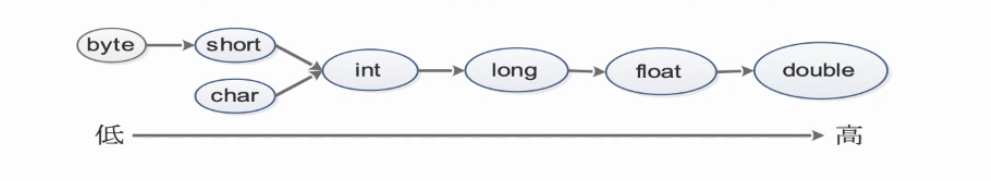

```Plain

```

## 运算符

### 算数运算符

> 对变量进行基本的数据运算

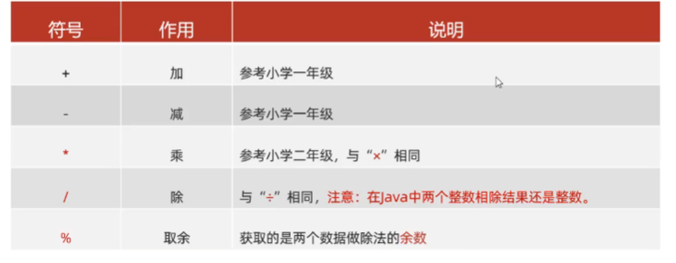

#### +号不仅可以做基本运算，还可以拼接字符串和变量

```Java
        int a=20;
        System.out.println("a的值是："+a);
```

#### 自增自减符号

> 前自加和后自加的区别，前是执行到这行代码时就自加，后是执行完这行才自加，循环是循环完本次后才自加

●+和--既可以放在变量的后边，也可以放在变量的前边。
●++、--只能操作变量，不能操作字面量的。

```Java
int a=10;
a++ 
--a


```

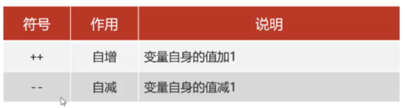

### 赋值运算符

```Java
// = 就是复制号
int a=10;
```

#### 扩展赋值运算符

> 注意：扩展的赋值运算符隐含了强制类型转换。对数据进行运算往后赋值同步操作

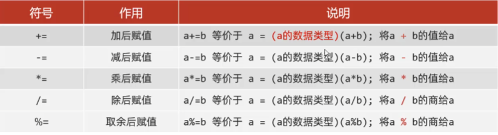

```Java
int a+=10；
```

### 关系运算符

> 是对数据进行条件判断的符号，最终会返回一个比较的布尔结果(false,true)

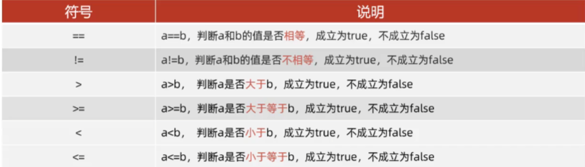

```Java
(a==b) =>false
```

### 逻辑运算符

> 可以把多个条件的布尔结果放在一起运算，最终返回一个布尔结果。对多个条件进行判断最终也返回布尔类型

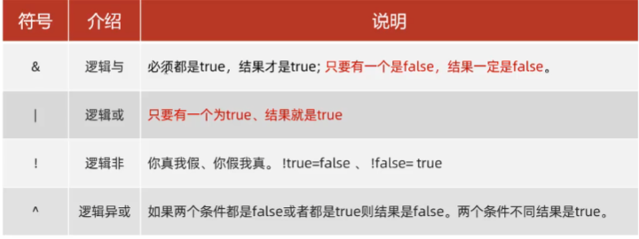

```Java
(a>b &&b>c)
```

### 三元运算符

> if语句的最简化，简短且可执行的语句有限

```Java
//语法
条件表达式? 值1 ：值2

当表达式为true时输出值1 false是输出值2
```

### 运算符优先级

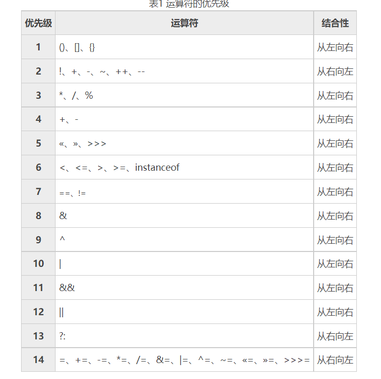

> 📌==  不能用于字符串比较，因为比较的是字符串的存储地址。字符串的特性是有一个之后后续在创建一样的也还是用原来的那个

## 流程控制语句

### switch

执行流程：
①先执行表达式的值，拿着这个值去与case后的值进行匹配。
②匹配哪个case的值为true就执行哪个case,遇到break就跳出switch分支。
③如果case后的值都不匹配则执行default代码。

> case的值是不能重复且只能是字面量（数字 字符串 等），且每个case内都要些break

```Java
表达式对应 值n就会执行第几个
switch(表达式)(
  case值1：
    执行代码.·；
    break;
    
  case值2：
    执行代码。，；
    break;
    
   case值n-1:
    执行代码。·，；
    break;
    
   default:
      执行代码n;
```

#### switch穿透性

> case中没有写break。出现switch穿透现象

switch穿透性能解决的问题，存在多个case分支的功能代码是一样时，可以用穿透性把流程集中到同一处处理，这样可以简化代码。

```Java
      //等于 1 3 5 7 8 10 12时都会输出 12的结果，因为会一直穿透下去
        int month= 7;
        switch
        (month){
            case 1:
            case 3:
            case 5:
            case 7:
            case 8:
            case 10:
            case 12:
                System.out.println(month+"是31天！");
                break;
            case 2:
                System.out.println(month+"月闰年为29天、非闰年为28天！");
                break;
            case 4:
            case 6:
            case 9:
            case 11:
                System.out.println(month+"是30天！");
                break;
            default:
                System.out.println("数据有误！");
        }
```

## 数组

#### 静态初始化

> 数组可存储很多同类型的数据

```Java
//声明数组的方式很多，推荐使用这一种
int[] arr={1,56,45}
```

#### 动态初始化

> 开始不确定数组内容，后面再加入

```Java
int[] a=new int[10] 
```

赋值给另一个数组时，赋的是地址

```Java
int[] brr=arr
```

访问索引值大于数组元素时出现ArrayIndexOutofBoundsException异常

```Java
int[] arr={1,56,45}

arr[6] //会报错了
```

赋值为null时

```Java
int[] arr=null;
 //会导致栈内存的地址为null 
 //访问元素时会报错

```

### 二维数组

```Java
        //静态初始化
        int[][] a={{1,2,3,4},{4,5,6,7},{8,9,10,11}};
        //动态初始化
        String[][] b=new String[10][10];
        b[0]=new String[]{"zahngsan","lisi","wangwu"};
        b[1]=new String[]{"java","python","c++"};
```

## JAVA内存分配

- 方法区

> 字节码文件加载时进入的内存

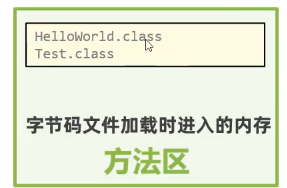

- 栈

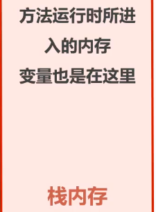

- 堆

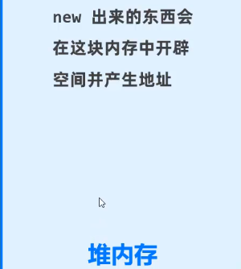

引用数据类型的指向，栈中只开辟一个存储地址的空间，元素实际会存在堆内存中

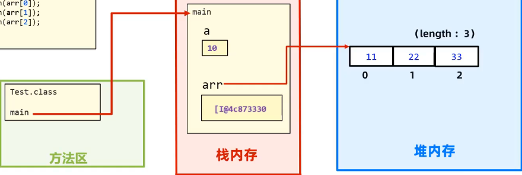

- 本地方法栈
- 寄存器

### 方法

> 作用是提高代码复用性和模块化代码结构方便维护。 方法是在类里面 的

```Java
   public static void main(String[] args) {
        //当需要使用时可直接调用避免了重复写
        int xu=sum(10,6);
        System.out.println(xu);
        //调用格式 方法名（参数）
        int zhang=sum(7,6);
        System.out.println(zhang);
    }
     //当不同的地方需要使用到同一段代码操作，可以抽离出来作为一个方法
    public static int sum(int a ,int b){
        return a+b;
    }
```

### 方法调用

> 方法不调用就不会执行

- 赋值调用

```Java
//将放回置赋值给一个变量
int a=sum()
```

- 输出调用

```Java
  System.out.println(sum());
```

- 直接调用 +无返回值的调用

```Java
//返回值不要了
sum()

```

#### 方法调用在内存中的流程

1. 将java文件加载到方法去
2. 将main放入栈区中执行，其他方法和基本数据类型的赋值也是在这里
3. 方法使用完之后会自动释放

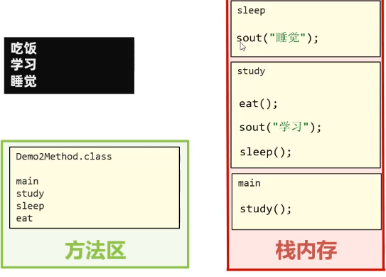

#### 方法中值的传递，参数（形参，实参）

> 方法名（参数值，参数值2）  实参的个数和形参的个数相同  ，调用的时候写的是实参，接收的方法叫形参

```Java
   public static void main(String[] args) {
                  //实参
        int xu=sum(10,6);
        System.out.println(xu);
    }
                        //形参
    public static int sum(int a ,int b){
        return a+b;
    }
```

> 传递的内容：  变量  常量  方法  引用数据变量 等

```Java
int[] arr={41,456,4}
//此时传递的是地址
sum(arr)
```

### 方法重载

> 同一个类中，出现多个方法名称相同，但是形参列表是不同的，那么这些方法就是重载方法。

作用就是可读性好 ，方法名称相同提示是同一类型的功能，通过形参不同实现功能差异化的选择，

参数列表： 个数  数据类型  参数顺序   public 有无都可

优化写法可以省略代码量，只需要指定某些默认值即可，重写+嵌套

```Java
    public static void main(String[] args) {
    fire("riben",5);
    }
    public static void fire() {
       // System.out.println("默认发射一枚武器给xxx国ww~");
       //优化写法
       fire("xxx国")
       return 
    }
    public static void fire(String country) {
       // System.out.println("默认发射一枚武器给"+country+"国ww~");
       //优化写法
       fire(country,1)
    }
    public static void fire(String country,int number) {
        System.out.println("发射"+number+"枚武器给"+country+"国ww~");
    }
```

> return可以在无返回值的方法中使用。即结束当前的方法

### 引用变量类型

> 引用变量类型的本意就是引用的只是一个地址，实际的值存在堆中，而栈中只有一个地址并指向堆。

数据类型：

- 基本数据类型

包括：btye  short int long  float double  booler char

- 复杂数据类型（引用变量类型）

包括：对象

```Java
  //操作是将类实例化成具体对象 ，而这个对象的数据类型是引用变量类型
  duixang c1=new duixang();
```

## 面向对象式编程OOP

> 以类为主题单位，一个类就是一个对象，类的设计包含以下部分

面向对象的三大特征：封装，继承，多态。

> 在实际编程中，一个java文件可以包含多个类，但实际开发时一个文件只放一个类

### 类

> 相同事物共同特征的描述 ，如人类

> 类的声明包含一下几点

- 访问权限

- 返回值类型

- 是否静态

- 类名

```Java
 public class human{
 }
```

#### 类的结构体设计

> 类只是一个抽象的集合 例如学生有  姓名 年龄 学号等 ，这就是一个类，但要具体到某个学生的信息时，就要把类给具体化，实例化出来。

1. 成员方法（方法）
2. 成员变量（属性）
3. 构造器（与类名相同的方法）
4. 代码块（  { }   ）
5. 内部类

> 📌类名首字母建议大写，有意义，满足驼峰，不
> 要用关键字，合法的标志符

> 📌一个Java文件中可以定义多个类，但是只能
> 一个类是poublic修饰的，而且public修饰的类名
> 必须成为java代码的文件名称，否则报错！

#### 成员方法

```Java
    //类
    public class duixang{
    // 成员变量 代表对象的属性 一般是名词
         int age;
        String name;
    
    //- 成员方法 代表对象的功能行为，一般是动词
        public int getAge() {
            return age;
            }
        - 构造器
        - 代码块
        - 内部类
    }
```

#### 成员变量

> 成员变量分为两种：静态变量和实例化成员变量

> 成员变量和局部变量的区别：

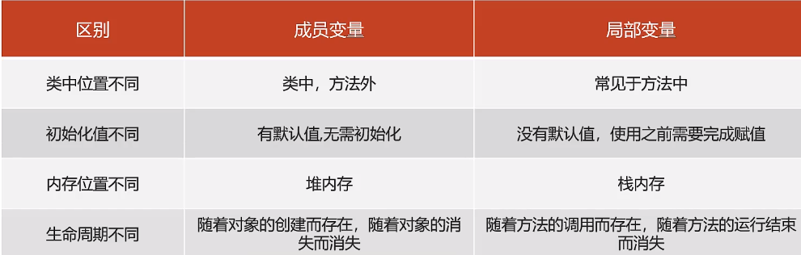


成员变量的两种类型

- 静态

```Java
    static int classcount = 39;
    //可以直接调用
      System.out.println("男孩数量"+
      boys);
```

- 实例

```Java
        //实例化构造方法类，然后通过调用类的属性实现。
         information s=new information();   
         System.out.println("男孩数量"+s.boys);

```

成员方法

- 构造方法（构造器） 没有返回值，与类的名字是相同的

```Java
    //   构造方法
    public information(int classcount, int boys, int girls) {
        super();
        this.classcount = classcount;
        this.boys = boys;
        this.girls = girls;
    }

    public information() {
        super();
    }


//引用时需要实例化对象才可以引用对象内的成员
```

- 普通方法（方法1.2.3.4）可选返回值，

```Java
public static void main(String[])
```

构造方法和普通方法的区别：构造方法名和类一致，不需要说明返回值。

#### 构造器

> 定义在类中的，可以用于初始化一个类的对象，并返回对象的地址。

- 无参数构造器（默认存在的）：初始化对象时，成员变量的数据均采用默认值。
- 有参数构造器：在初始化对象的时候，同时可以接收参数为对象进行赋值。定义有参后如果还需要调用无参就需要额外定义无参

```Java
//
duixiang obj=new Car()

public class Car{

//无参数构造器，作用就是返回这个初始对象，和返回地址，即使没写也会自动加上
      public Car(){

    }
//有参数构造器，可在实例化的同时也传递参数
    public Car( int a){

     }

}


```

### 代码块

> 在)ava类下，使用()括起来的代码被称为代码块。定义在类中方法之外

分为静态代码块和构造代码块

#### 静态代码块

- 格式：static{}
- 特点：需要通过static关键字修饰，会随着类的加载而加载，并会自动触发，只执行一次
- 使用场景：在加载类的时候做一些静态初始化的操作

```Java
  public  static int z;
    static {
        z=6;
    }
```

#### 构造代码块（仅了解）

- 格式：{}
- 特点:每次创建对象，调用构造器时都会执行这个代码块中的代码，并且在构造器之前执行
- 初始化实例资源

```Java
  public  static int z;
    static {
        z=6;
    }
```

### this

> 可以用于指定访问当前对象的成员变量、成员方法。

- 可以出现在构造器、方法中
- 代表当前对象的地址。

局部的变量和方法名本身是没有意义的只是为了传参，但是重新命名有过于麻烦，并且局部和全局冲突的时候难以指定，this指向的是成员（全局）的变量，age指向的是当前方法的局部变量

```Java
    public static class duixang{
        int age ;
        String name;
        public void car(int age ,String name){
        this.age=age;
        this.name=name;
        }
    }
```

### 封装

> 封装告诉我们，如何正确设计对象的属性和方法。

将常用的代码封装起来方便以后调用可以不用多次重复写

封装的原则：对象代表什么，就得封装对应的数据，并提供数据对应的行为。

当几个对象相互作用的时候就难以分辨方法的归属问题。

在面向对象中  ，  人画园这个操作，

人有属性和方法，但是画园并不是人本身的方法，而是调用了园的方法，园定义有半径等属性，根据这个属性从而形成的园，所以人是调用画圆的方法

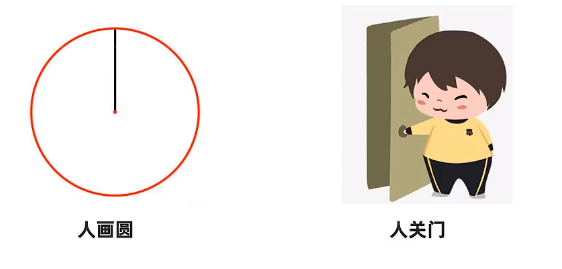

### 封装权限

> 封装时public 权限可以直接数据赋值会导致一些业务逻辑的错误

```Java
    public static class duixang{
        int age ;
         String name;
        public void car(int age ,String name){
        this.age=age;
        this.name=name;
        }
    }
    
    //逻辑上是错误的，没有负的年龄
    duixiang.age=-100 
    //所以不应该能直接赋值，而是通过间接的设置
    
```

#### getter和setter

> 将public 改为 私有的 private ，此时的修改权限只有类的内部才可以调用

```Java
       private int age ;
       private  String name;
       
        public int getAge() {
            return age;
        }

        public void setAge(int age) {
            this.age = age;
        }

        public String getName() {
            return name;
        }

        public void setName(String name) {
            this.name = name;
        }
```

### JavaBean

> 也可以称为实体类，其对象可以用于在程序中封装数据。

实体类是这个类对应现实生活中真正存在的对象，比如 车类  人类  猴子类

#### 标准]avaBean须满足如下书写要求：

- 成员变量使用private修饰。
- 提供成员变量对应的setXxx0/getXxx(0方法。
- 必须提供一个无参构造器；有参数构造器是可写可不写的。

```Java
  public static class User{
    private String name;
    private int age;

        public User() {
        }

        public User(String name, int age) {
            this.name = name;
            this.age = age;
        }

        public String getName() {
            return name;
        }

        public void setName(String name) {
            this.name = name;
        }

        public int getAge() {
            return age;
        }

        public void setAge(int age) {
            this.age = age;
        }
    }
```

## API

> 直译 应用程序接口，简单理解就是调用已经写好的程序

- 导入包
- 实例化包
- 调用实例化方法

#### api的简单应用

### Scanner的 简单应用

> next和nextInt的区别

- next遇到空白时停止，读取输入后将光标放在同一行中
- nextInt 读取遇到回车停止，读取输入后将光标放在下一行中
- nextLine 是读取字符串的

```Java
  import java.util.Scanner;
  
   //在idea编辑的时候直接输入Scanner 就可以自动导入
        Scanner sc=new Scanner(System.in);
        //调用功能
        System.out.println("请输入年龄");
        //Int表示接的是整数
        int age=sc.nextInt();

        System.out.println("请输入名称");
        String name=sc.next();
```

### Random() 的简单使用

```Java
        Random r= new Random();
        //生成0-10的中的整数
        int number=r.nextInt(10);
        //生成1-10的中的整数
        int number2=r.nextInt(10)+1;
        System.out.println("number:"+number+"----number:"+number2);
```

### ArrayList

- ArrayList代表的是集合类，集合是一种容器，与数组类似，不同的是集合的大小是不固定的。集合非常适合做元素个数不确定，且要进行增删操作的业务场景。
- 通过创建ArrayList的对象表示得到一个集合容器，同时ArrayList提供了比数组更好用，更丰富的API(功能)给程序员使用。
- 可以存储任意类型的元素，但不建议这么做

> 📌数组定义完成并启动后，类型确定、长度固定。在个数不能确定，且要进行增删数据操作的时候，数组是不太合适的。

#### 创建ArrayList集合，

集合是对象

```Java
ArrayList arr=new ArrayList<>();

//以后定义必须得定义数据类型
      ArrayList<String> list2=new ArrayList<>();
        list2.add("Sadasd");
定义数据类型后只能写这个类型的数据

//泛型，支持很多类型，但也不能乱用
  ArrayList<objet> list2=new ArrayList<>();
        list2.add("Sadasd");


```

#### add添加数据

> 添加数据,返回值为添加结果，类型为布尔型 可指定位置

```Java
 
 //语法   插入位置，插入元素,如果不指定插入位置则参入到最后
 集合.add(index,data)
 
        arr.add("java2");
        arr.add(1,"java2");
        System.out.println(arr.add("java"));
```

#### get获取元素

> :获取某个索引位置处的元素值

```Java
//1、public E get(int index)
String e= List.get(3);
System.out.println(e);
```

#### size获取集合元素个数

```Java
//2、public int size():获取集合的大小（元素个数）
 System.out.println("元素个数"+list2.size());
```

#### 遍历集合

```Java
//3、完成集合的遍历
for (int i=0;i<list.size();i++){
System.out.println(list.get(i));
}

```

#### remove删除元素

> 删除某个索引位置处的元素值，并返回被删除的元素值，也可以指定被删除元素的内容去删除，但只会删除第一个，从头往后的第一个

```Java

public E remove(int index)
        list2.add("Sadasd");
        list2.add("asdasdddd");
        list2.add("asdasdddd");
        list2.add("asdasdddd");
        //list2=Sadasd，asdasdddd，asdasdddd，asdasdddd
        
        //会返回被删除的值
        list2.remove(1);
        list2.remove("asdasdddd");
        
       // list2=Sadasd asdasdddd

```

#### set修改元素

> 修改某个索引位置的元素值 ，也会返回被修改的值

```Java
String e3=1ist1.set(0,"贾乃亮")；
System.out.println(e3);
System.out.println(list1);
```

### String

> java.lang.String类代表字符串，String类定义的变量可以用于指向字符串对像，然后操作该字符串。

- 创建后不可变内容，更改是创造了新的空间进行存储，并且把String对象地址指向新的地址

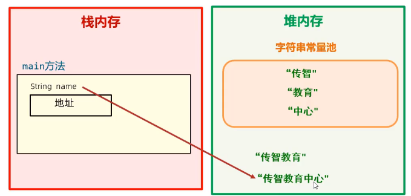

- 直接输出String对象也可以输出结果是因为jvm的优化结果

```Java
//声明的几种方式 

String name="asdsa"

//几乎不用
String name=new String()

```

```Java
//当创建的内容一样的时候，变量池中就不会在开辟新的空间进行存储，而是将namee
//的地址指向了name


String name="asdsa"

String namee="asdsa"

```

- 以“”方式给出的字符串对象，在字符串常量池中存储，而且相同内容只会在其中存储一份。
- 字符串常量值是建再堆内存中的一个对象空间。
- 通过构造器new对象，每new一次都会产生一个新对象，放在堆内存中。并会存到字符串常量池中

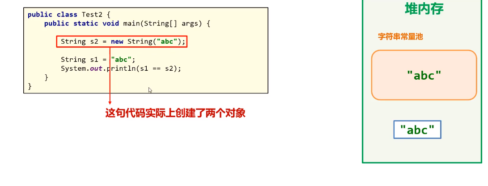

### String常用的方法

#### equals方法

> 用于字符串内容之间的比较

```Java
    public static class Stringtesr{

        String okname="asd";
        String okpassword="aa";

        public void test(){
            Scanner sc=new Scanner(System.in);
            System.out.println("输入名字");
           String name=sc.next();
            System.out.println("请输入密码");
           String password=sc.next();

            if(okname.equals(name)&&password.equals(okpassword)){
                System.out.println("登入成功");
            }else {
                System.out.println("账号或密码错误");
            }


        }


    }


```

#### equalsIgnoreCase

> 忽略大小写进行字符串之间的比较

```Java
    public void img(){
            String name="Asd";
            System.out.println(okname.equalsIgnoreCase(name));

        }
```

#### charAt索引

> 获取某个索引位置处的字符,可以通过索引来遍历输出所有的字符

```Java
String name="asdsa"
char c=name.charAt(1)
            char c=name.charAt(1);
            System.out.println("第一个字符是"+c);

```

#### toCharArray()将字符串转化为字符数组

```Java
char[]chars= name.toCharArray();
for (int i 0;i<chars.length;i++){
char ch= chars[i];
System.out.println(ch);
}
```

#### substring(int index ,int end index)

> 截取字符串,会产生新的字符串，原来的字符串不变，需要去接收

```Java
//语法,可以只写开头，会截取到最后
字符串.substring(begin index,endindex)


name2.substring(4,9);

```

#### replace替换

> 会产生新的字符串，原来的字符串不变，需要去接收

```Java
String name3="金三胖是最厉害的80后，金三胖棒棒的！我好爱金三胖"；

name3.replace(target:"金三胖"，replacement:"**");
```

#### contains

查询是否包含,返回值是布尔型

```Java
System.oUt.println(name3.contains("金三胖"))；//trUe
System.out.println(name3.contains("金二胖"))；//false
```

## 面向对象

> 通过构造器实例化对象时。且有继承状态下，子类的构造器中自带super方法调用父类的无参构造器。有静态代码块和无参构造器同时存在时，会先执行静态代码块

```Java
class test
   
```

### 类和对象的关系

> 类是一个抽象概念，是一个大范围的东西。

对象是一个具体的东西。

类实例化之后就变成了具体的对象

人实例化到某个具体的人，而这个具体的人可能会有自己的性格想法等，但是总体人这个类包含的对象也会包含比如眼睛鼻子耳朵

### 类

> 类的抽象理解有两种方法，一种是面向对象，一种是面向过程。

> 面向对象是以方法为对象进行分离，数据以成员变量型式，函数以对象型式

```Java
package clas;

public class information {
    //变量要放在类下面，要不然生成的构造函数就不能选择参数
//    使用静态方法可以直接全局调用更方便
    static final int classnumber = 2102;
    static int classcount = 39;
    static   int boys = 33;
    static   int girls = 6;

    //   构造方法
    public information(int classcount, int boys, int girls) {
        super();
        this.classcount = classcount;
        this.boys = boys;
        this.girls = girls;
    }

    public information() {
        super();
    }

    public   static  void getmaxin(int boys, int girls) {
//        return boys>girls?boys:girls;
        if (boys > girls) {
            System.out.println("男生比女生多" + "男生人数" + boys);
        } else {
            System.out.println("女生比较多" + "女生人数" + girls);
        }
    }
    public   static  void getnum(int classnumber){
        if(classnumber%2==0){
            System.out.println("班级编号是偶数");
        }else{
            System.out.println("班级编号是集数");
        }
        System.out.println("班级人数"+classcount+"班级号"+classnumber);

    }


    public static void main(String[] args) {
        //实例化类，然后通过调用类的属性实现。 information s=new information();   
        
        //  System.out.println("男孩数量"+s.boys);

        System.out.println("男孩数量"+boys);
        System.out.println("女孩数量"+girls);
        System.out.println("人数数量"+classcount);
        getmaxin(boys, girls);
        getnum(classnumber);

    }

}

```

面向对象有三个特性：继承性 封装性和多态性

- 继承是可以把父级内的所有东西结成，
- 封装性是把单独的对象封装起来成一个类方便后面复用
- 多态性是指

### 类的实例化→对象

> 类是抽象的，只有实例化之后才会给某个东西附上具体的值从而变成一个具体的对象。 例如 学生名字 xx  年龄18.....

```Java
//语法  ,对象名指的就是实例化之后的这个具体类的名字

类名(数据类型) 对象名 =new 构造器(可选参数)
duixiang obj=new duixang()

//可定义为数组，存储几个对象
duixiang[] obj=new duixang[3]

duixiang[]=objarr

Movie[]movies = new Movie[3];

Movie m1=new Movie〔name:"《长津湖》"，5core:9.7,actor:"吴京")；
movies[0]=m1;


movies[0]=new Movie〔name:"《长津湖》"，5core:9.7,actor:"吴京")；

```

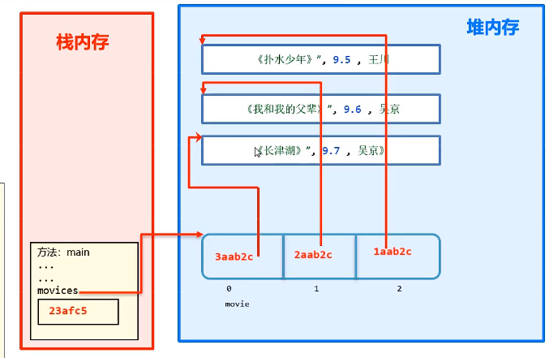

### 对象的调用

> 对象创建成功之后，可以给对象的属性赋值，获取属性值，增加等操作

对象内容存储在堆内存中

对象本身只是一个堆的地址

```Java
//调用对象的属性

//语法  对象名.属性名   对象名.方法名()
obj.name
obj.getAge()
```

### 类和对象的内存图解


- 对象的成员方法不会存在堆内存中，而是会放到方法区
- 对象的基本数据类型会放在堆内存中


- static关键字
- 设计模式
- 继承

### static静态

●static是静态的意思，可以修饰成员变量和成员方法。
●static修饰成员变量表示该成员变量只在内存中只存储一份，可以被共享访问、修改。

> 被静态变量修饰之后就归属于类

实例化方法归属于 对象

### 静态变量

```Java
package staticjingtai;

public class staticpar {

    //静态类型分为两种，

    //静态变量
    public static int jingtai=10;

    //静态方法
    public static void main(String[] args) {

        waibi.user();
    }


}

 class waibi{
 public static void user(){

     //访问变量的两种方法
     //类名.静态变量 ，
     System.out.println(staticpar.jingtai);
     //同一个类中访问静态变量可直接写变量名
     System.out.println(jingtai);
     //对象.静态变量（不推荐使用）低版本中会报错
     staticpar sta=new staticpar();
     int jingtai = sta.jingtai;
     System.out.println(jingtai);


 }


}
/d
```

#### 静态变量内存区

可以被全部的对象访问

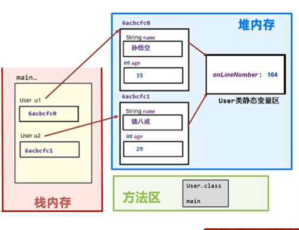

### 静态方法

- 静态成员方法
- 实例成员方法

```Java
 
 /实例成员方法
 public void re(){
     
 }
 
 //静态成员方法
 public static void user(){
}
```

#### 使用场景

·表示对象自己的行为的，且方法中需要访问实例成员的，则该方法必须申明成实例方法。
·如果该方法是以执行一个共用功能为目的，则可以申明成静态方法。

#### 注意事项

·静态方法只能访问静态的成员，不可以直接访问实例成员。（可通过实例化类来访问）
·实例方法可以访问静态的成员，也可以访问实例成员。
●静态方法中是不可以出现this关键字的。

> this指向该对象，而static并没有对象，只存在堆内存中的静态区/

### 静态工具类代码块

> 用来写需要重复使用的一些方法例如验证码，方便后续调用

优势在于不用每次都创建对象再访问，从而节省了内存

```Java
    static {
        z=6;
    }
```

- 禁止构造对象，将构造器私有化。专业写法

```Java
  //staticpar.java
  private staticpar() {
    }
```

### 实例工具代码块

实例化类之后就会调用，在构造函数前调用这个代码块内的代码

```Java
{
//代码
int z=6;


}
```

‍

### 理解Main方法

从根源上理解main方法为什么是这样写

​`public static void main(String[] args) {} `​

1. main方法是由虚拟机调用类中的mian方法，所以要写成public，要不然会调用不到。
2. java虚拟机在执行main方法时不必创建对象，所以方法必须是static
3. 该方法接收String类型的数组参数，该数组中保存执行java命令时传递给所  
    运行的类的参数案例演示，接收参数.

‍

‍

## 设计模式

开发中经常遇到一些问题，一个问题通常有种解法的，但其中肯定有一种解法是最优的，这个最优的解法被人总结出来了，称之为设计模式。

- 该模式用来解决什么问题
- 遇到问题，该模式是怎么写的，如何解决该问题

### 单例设计模式

1. 饿汉式
2. 懒汉式

两者的区别是在对象创建的时机，饿汉式是一家在就创建，懒汉式是调用时才创建。

在我们javaSE标准类中，java.lang.Runtime就是经典的单例模式。

> 定义类并且把构造器私有，定义静态变量存储对象，以此对外只提供一个对象，

```Java

public class sheji {

    //静态形式共享sheji的实例化对象 instance
    public static sheji instance=new sheji();
    private sheji() {
    }
}


```

在调用后再生成

```Java
class last{
    private static last getInstance;

    //定义返回类型是对象
    public static last getInstance(){
        if (getInstance==null){
            getInstance=new last();
        }
    return getInstance;
    }

}
```

调用方式

```Java
class test{
    public static void main(String[] args) {
        //单例模式
        sheji like=sheji.instance;

        //单例模式延迟设计模式
        last kz=last.getInstance();
    }
}/d
```

‍

#### 饿汉式

1. 构造器私有化——>防止new
2. 类的内部创建对象
3. 向外暴露静态的公共方法用于获取对象

> 饿汉式：类被加载时就会创建这个对象，不论掉不掉用，所以是饿汉式
>
> 加载≠实例化

```java
public class Main {
    public static void main(String[] args) {
        System.out.println("Hello world!");

//      直接调用,不需要实例化
        IdNumber  id=  IdNumber.getId();
        System.out.println(id);

    }
}

//Single mode
//外部不能创建对象，但是可以调用对象。
class IdNumber{
//    1.定义属性
    private int  PersonAlId;
//  在类的内部创建对象,为了能在静态方法中返回对象，需要修饰为static
    private static IdNumber id=new IdNumber(450122222);

//   2. 定义私有构造器
    private IdNumber(int personAlId) {
        PersonAlId = personAlId;
    }

    @Override
    public String toString() {
        return "IdNumber{" +
                "PersonAlId=" + PersonAlId +
                '}';
    }

    //    向外暴露创建好的对象,加static的目的是为了不创建对象创建方法
    public static IdNumber getId() {
        return id;
    }
}
```

‍

‍

#### 懒汉式

> 只有在使用的时候才会去创建这个对象，不是随着类加载而创建。

> 存在线程安装问题，因为多线程执行代码。

```java
//懒汉式

class CreateChat{
    public static String  MessageList="dasdas";

    //提前声明CreateChat类方便后续使用
    private static CreateChat ChatStrat;

    private CreateChat(String messageList) {
        MessageList = messageList;
        System.out.println("创建对象");
    }

    @Override
    public String toString() {
        return "CreateChat{" +
                "MessageList='" + MessageList + '\'' +
                '}';
    }

    //    只有在调用getInstance时才会创建对象并且返回
    public static CreateChat getInstance(){
        if (ChatStrat==null){
            ChatStrat= new CreateChat("mwqe");
        }
        return  ChatStrat;
    }

}
```

‍

‍

‍

## 面向对象核心2：继承

> 继承是两个建立父子关系然后继承另一个类的成员方法和成员变量

解决重复代码，一次编写一直可以调用，增强类的功能扩展性

语法

```Java
 子类 extends 父类
 classmate extends student
```

> 📌继承后就可以当自己的方法直接进行调用

test类

```Java
public class test {
    public static void main(String[] args) {
        extdents testt=new extdents();
        testt.setName("张三");
        testt.priname();
    }
}
```

extendts类

```Java
public class extdents extends student  {

    public void priname(){
        System.out.println("名字是"+getName());
    }

}
```

student类

```Java
package extendsstudy;

public class student {
     private   String name;
     private   int age;

    public String getName() {
        return name;
    }

    public void setName(String name) {
        this.name = name;
    }

    public int getAge() {
        return age;
    }

    public void setAge(int age) {
        this.age = age;
    }
}

```

### 继承内存原理

> 调用时实例化后在内存中当做一个对象来看 ，但在内部还是单独当做两个对象来看

父类是 super

子类是 this

一旦继承就会继承全部的方法和变量，所以父类中的成员的添加要谨慎

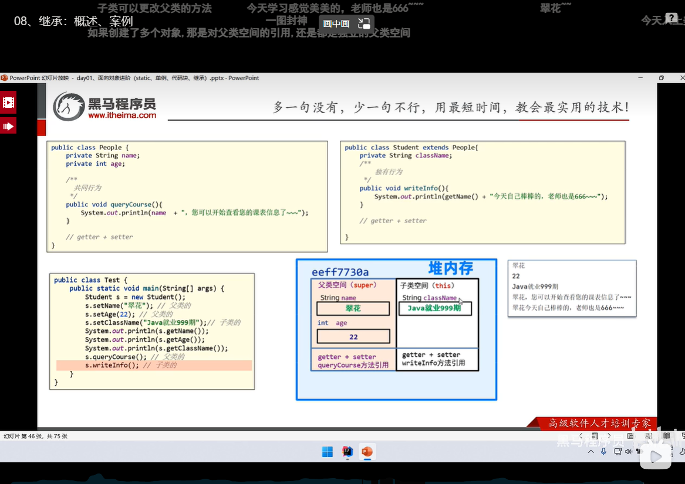

### 继承的特点

①子类可以继承父类的属性和行为，但是子类不能继承父类的构造器
②Java是单继承模式：一个类只能继承一个直接父类。
③Java不支持多继承、但是支持多层继承。
④Java中所有的类都是Object类的子类

> 📌子类其实是可以继承父类的私有方法，只是不能调用，也可以说是不能继承（有争议）

> 📌静态成员不算继承，因为是共享的只有一份在静态区中所有方法都可以访问

> 📌多层继承如果有冲突（有相同的方法）会优先调用继承关系近的类。

### Super父类访问关键词

> 在子类中访问时，当父类和子类的成员冲突时，默认访问继承关系近的子类，但也可以使用super来访问父类的

```Java
package extends_confli;

public class test {
    public static void main(String[] args) {
        dog d1=new dog();
        d1.getname();
    }
}

class Animal{
    String name="动物";

}

class dog extends Animal{
    String name="狗";
    public  void getname() {
        //默认是输出子类的name
        System.out.println(this.name);
        //访问父类的name
        System.out.println(super.name);
    }

}

》》
》狗
》动物
```

### 继承时的方法重写

> 在继承体系中，子类出现了和父类中一模一样的方法声明，我们就称子类这个方法是重写的方法。

●当子类需要父类的功能，但父类的该功能不完全满足自己的需求时。
●子类可以重写父类中的方法。

#### @override重写注解

> 在方法重写时 加上@override 1、重写校验注解，加上之后，这个方法必须是正确重写的，这样更安全。2、提高程序的可读性，代码优雅！

> 📌继承下方法重写时 方法名称 和形参列表必须一样

> 📌私有方法不能被重写

> 📌子类重写父类方法时，访问权限必须大于或者等于父类（暂时了解：缺省<protected<public)

```Java
package extends_confli;

public class test {
    public static void main(String[] args) {
        dog d1=new dog();
        d1.getname();
        d1.run();
    }
}

class Animal{
    String name="动物";
    public void run(){
        System.out.println("跑得很快");
    }

}

class dog extends Animal{
    String name="狗";
    public  void getname() {
        //默认是输出子类的name
        System.out.println(this.name);
        //访问父类的name
        System.out.println(super.name);
    }
    @Override
    public void run(){
        super.run();
        System.out.println("跑的特别快");
    }

}


```

### 构造器访问

继承时 子类会先访问父类的无参构造器，,子类中所有的构造器默认都会先访问父类中无参的构造器，再执行自己。

子类在初始化的时候，有可能会使用到父类中的数据，如果父类没有完成初始化，子类将无法使用父类的数据。
子类初始化之前，一定要调用父类构造器先完成父类数据空间的初始化。

> 📌子类构造器中 默认存在  super()  自动添加的，执行后马上调用父类

```Java
package extends_confli;

public class extends_constr {
    public static void main(String[] args) {
        dogz d1=new dogz();
                d1.show();
    }
}

class Animalz{
    public Animalz() {
        System.out.println("父类无参构造器被调用");
    }
}

class dogz extends Animalz{
    public dogz(){

        System.out.println("子类构造器被调用");
    }
    public void show(){


    }

}
```
