# JAVA2

#### super调用父类有参构造器

> 初始化继承来自父类的数据

```Java
package extends_confli;

public class extends_constr {
    public static void main(String[] args) {
        dogz d1=new dogz("zzz",18);
    }
}

class Animalz{
    public Animalz() {
        System.out.println("父类无参构造器被调用");
    }
      public Animalz(String name,int age){
        System.out.println("子类有参数构造器被调用");
    }
}

class dogz extends Animalz{
    public dogz(String name,int age){
        System.out.println("子类构造器被调用");
    }

}
```

> 📌如果父类中没有无参数构造器，只有有参构造器
> ●会报错。因为子类默认是调用父类无参构造器的。

> 📌在子类构造器中调用父类有参构造器super（）来初始化父类变量来解决

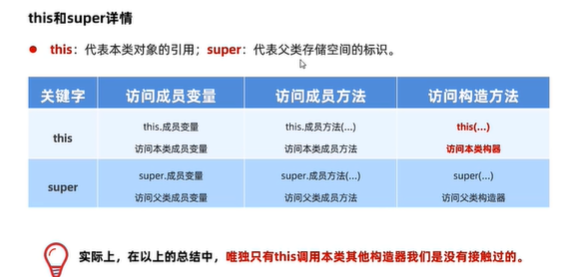

#### this.()

> 作用是、调用当前对象的构造器。如果带参数就调用有参的

> 作用在只填入一个值的时候就可以调用当前的方法然后传入另一个固定的值

```Java
this.(name,"传递的固定值")
```

# 面向对象进阶

- 包
- 权限修饰符
- final
- 常量

### 包

> 包是用来分门别类的管理各种不同类的，类似于文件夹、建包利于程序的管理和维护。

> 📌建包的语法格式：package公司域名倒写.技术名称。报名建议全部英文小写，且具备意义,且必须在第一行

```Java
package cn.hui7.top
```

#### 包的权限

> 同一个包下类之间可以直接访问不用导入

> 可以使用快捷键一键导入包

> 不同包下的访问

cn.hui7.top 包

```Java
package cn.hui7.top
```

test包

```Java
import cn.hui7.top
```

#### 包内类名冲突

> 当两个包中有相同名字的方法或者成员时，第一个可以直接写类名，第二个要写全名（包全名.类名/方法名/成员）

```Java
package ttes;

import ttes.cn1.test;

public class testtt {
    public static void main(String[] args) {
        test t1=new test();
        ttes.cn2.test t2=new ttes.cn2.test();
    }
}

```

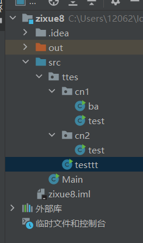

### 权限修饰符

> ·权限修饰符：是用来控制一个成员能够被访问的范围。

·可以修饰成员变量，方法，构造器，内部类，不同权限修饰符修饰的成员能够被访问的范围将受到限制。

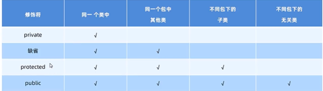

### final关键字

> 一般用于工具类，不需要被其他类继承和重写，覆盖值。用于基础类，基础便令

- final关键字是最终的意思，可以修饰（类、方法、变量）
- 修饰类：表明该类是最终类，不能被继承。
- 修饰方法：表明该方法是最终方法，不能被重写。
- 修饰变量：表示该变量第一次赋值后，不能再次被赋值（有且仅能被赋值一次）。

```Java
final int i=10;
//让传递进来的参数不可更改
void test(final double z)
```

- final修饰的变量是基本类型：那么变量存储的数据值不能发生改变。
- finl修饰的变量是引用类型：那么变量存储的地址值不能发生改变，但是地址指向的对象内容是可以发生变化的。

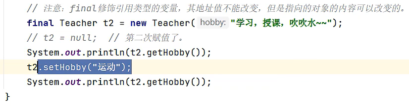

### 常量

- 常量是使用了public static final修饰的成员变量，必须有初始化值，而且执行的过程中其值不能被改变。
- 常量的作用和好处：可以用于做系统的配置信息（但一般用枚举来做），方便程序的维护，同时也能提高可读性。

```Java
public static final String STUDENT_NAME="张三"
public static final int PI =3.14
```

常量命名规范：英文单词全部大写，多个单词下划线连接起来。


#### 常量的执行原理

- 在编译阶段会进行“宏替换”，把使用常量的地方全部替换成真实的字面量。
- 这样做的好处是让使用常量的程序的执行性能与直接使用字面量是一样的。目的是方便人来写。在程序运行时即使是数字什么的都无所谓不关心

```Java

public static final String PASS_WORD ="123456";
System.out.println(PASS_WORD);

//编译后 全部替换成字面量提高性能
System.out.println("123456");


```

### 枚举

- 枚举是java中的一种特殊类型
- 枚举的作用："是为了做信息的标志和信息的分类”。可读性好，入参约束严谨，代码优雅，是最好的信息分类技术！
- 枚举类都是继承了枚举类型：java.lang.Enum枚举都是最终类，不可以被继承。
- 构造器的构造器都是私有的，枚举对外不能创建对象。
- 枚举类的第一行默认都是罗列枚举对象的名称的。

定义枚举类的各式

枚举的第一行必须罗列枚举类的对象名称，建议全部大写。

```Java
// 修饰符 enum 枚举名称{
    //第一行都是罗列枚举类实例的名称。
}

```

```Java
enum Season{
SPRING,SUMMER,FALL,WINTER
}
```

反编译后的文件

```Java
Compiled from "Season.java"
public final class Season extends java.lang.Enum<Season>{
public static final Season SPRING new Season();
public static final Season SUMMER new Season();
public static final Season FALLL  new Season();
public static final Season WINTER new Season();
public static Season[]values();
public static Season valueof(java.lang.String);
```

调用

```Java
Season.SUMMER
```

### 抽象

- 在java中abstract是抽象的意思，可以修饰类、成员方法。抽象方法只有方法签名，不能写方法体。因为会被子类继承但并不是所有子类都需要
- abstract修饰类，这个类就是抽象类；修饰方法，这个方法就是抽象方法。一个类中定义了抽象方法，这个类必须声明成抽象类。
- 一个类如果继承了抽象类，那么这个类必须重写完抽象类的全部抽象方法，否则这个类也必须定义成抽象类。重写完才是一个具体的类
- 抽象类中可以没有抽象方法，但是有抽象方法的必须是抽象类。抽象类不能被实例化即被创建对象。

```Java
package abstractpacg;

//抽象类
abstract public class abstractclass {
    public static void main(String[] args) {

    }
//    抽象方法 abstract void poeak
    void poeak();
}

```

#### 使用场景：

- 抽象类可以理解成不完整的设计图，一般作为父类，让子类来继承。
- 当父类知道子类一定要完成某些行为，但是每个子类该行为的实现又不同，于是该父类就把该行为定义成抽象方法的形式，具体实现交给子类去完成。此时这个类就可以声明成抽象类。

```Java
abstract class Animal{
    double v;
    abstract void run();
}
class Dog extends Animal{
    @Override
    void run() {
         v=10.6;
        System.out.println("狗子再跑，速度是："+v);
    }
}


```

#### final和abstract

- 两者是互斥的关系
- final定义的类不能用来继承。
- abstract就是用来被继承的。

### 设计模式：模板设计方法

> 使用场景说明：当系统中出现同一个功能多处在开发，而该功能中大部分代码是一样的，只有其中部分可能不同的时候,模板方法我们是建议使用final修饰的,这样更安全。

模板部分 ，是抽象类，final方法

```Java
 abstract public class templ {
    final void wirte(){
       System.out.println("模板开头");

         System.out.println(rewrite());

       System.out.println("模板结束");
    }
   public abstract String rewrite();
}

```

子类调用

```Java
public class studentwrite extends templ {

    @Override
     public String rewrite() {
        return "这是正文部分，子类返回值父类整合到模板中";
    }
}

```

测试类

```Java
public class test {
    public static void main(String[] args) {
        studentwrite s1=new studentwrite();
        s1.wirte();
    }
}

```

# 接口

- 接口中的成分特点：JDK8之前接口中只能有抽象方法和常量。
- 接口内的方法都是默认公开的，接口的目的就是给别人调用
- 接口内的方法都是抽象的

### 定义语法

> 没有类，只有接口有

```Java

public interface jiekou{

    String SCHOOL_NAME="wuit";

    void run();

}

```

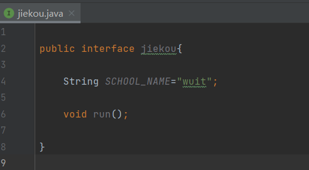

### 接口的使用

作用：接口是用来被类实现(implements)的，实现接口的类称为实现类。实现类可以理解成所谓的子类。

接口

```Java

public interface jiekou{

    void run();

}

public interface jiekou2 {
    void sleep();
}

```

实现类

测试类可以实施多个接口

```Java
public class shishilei implements jiekou,jiekou2{

    String SCHOOL_NAME;

    public shishilei(String SCHOOL_NAME) {
        this.SCHOOL_NAME = SCHOOL_NAME;
    }

    @Override
    public void run() {
        System.out.println(SCHOOL_NAME+"快跑");
    }

    @Override
    public void sleep() {
        System.out.println(SCHOOL_NAME+"快睡");
    }
}


```

测试类

```Java
public class test {
    public static void main(String[] args) {
        shishilei s2=new shishilei("wuit");
        s2.run();
        s2.sleep();

    }
}

```

### 接口的继承

- 类和类的关系：单继承。
- 类和接口的关系：多实现。
- 接口和接口的关系：多继承，一个接口可以同时继承多个接口。接口有冲突（方法名相同等）时不能多继承

接口1

```Java
public interface jiekou1{
    void run();
}

```

接口2

```Java
public interface jiekou2{
    void run();
}

```

接口3 ,接口可以实现多继承

```Java

public interface jiekou3 extends jiekou1,jiekou2{
    void sleep();
}
```

实现类

当接口进行多继承之后，实现类只需要实现一个接口即可

```Java
public class shishilei implements jiekou3 {

    String SCHOOL_NAME;

    public shishilei(String SCHOOL_NAME) {
        this.SCHOOL_NAME = SCHOOL_NAME;
    }

    @Override
    public void run() {
        System.out.println(SCHOOL_NAME+"快跑");
    }

    @Override
    public void sleep() {
        System.out.println(SCHOOL_NAME+"快睡");
    }
}

```

‍

### 接口的多态

1. #### **接口引用可以指向实现了接口的类的对象**

   首先，我们定义一个接口：

   ```java
   public interface Animal {
       void makeSound();
   }
   ```

   然后，我们创建一个类来实现这个接口：

   ```java
   public class Dog implements Animal {
       public void makeSound() {
           System.out.println("汪汪汪！");
       }
   }
   ```

   现在，我们可以创建一个接口类型的引用，指向实现了该接口的类的对象：

   ```java
   public class Main {
       public static void main(String[] args) {
           // 创建Dog类的对象
           Dog myDog = new Dog();

           // 创建Animal接口的引用，指向Dog对象
           Animal myAnimal = myDog;

           // 通过接口引用调用实现类的方法
           myAnimal.makeSound(); // 输出：汪汪汪！
       }
   }
   ```

   在这个例子中，`myAnimal`​是一个接口类型的引用，它指向了一个`Dog`​类的实例。因为`Dog`​类实现了`Animal`​接口，所以这是合法的。通过`myAnimal`​引用调用`makeSound()`​方法时，实际上调用的是`Dog`​类中对该方法的实现。这就是Java中接口和多态的一个基本示例。

‍

#### 接口**多态数组**

多态数组是指数组中的元素类型为一个接口或抽象类，而数组的实际元素则是实现了该接口或继承了该抽象类的不同子类的对象。这样，数组可以存储不同类型的对象，但它们都通过共同的接口或抽象类来交互。

这种数组的特点是，**尽管数组中的每个对象可能是不同类型的，但我们可以通过共同的接口或抽象类的方法来操作这些对象，这就是多态性的体现。**

首先，我们定义一个接口：

```java
public interface Shape {
    void draw();
}
```

然后，我们创建几个实现该接口的类：

```java
public class Circle implements Shape {
    public void draw() {
        System.out.println("画圆形");
    }
}
public class Square implements Shape {
    public void draw() {
        System.out.println("画正方形");
    }
}
```

现在，我们可以创建一个多态数组，存储不同类型的`Shape`​对象：

```java
public class PolymorphicArrayDemo {
    public static void main(String[] args) {
        // 创建一个Shape类型的数组
        Shape[] shapes = new Shape[2];
    
        // 向数组中添加Circle和Square对象
        shapes[0] = new Circle();
        shapes[1] = new Square();
    
        // 遍历数组，调用每个对象的draw方法
        for (Shape shape : shapes) {
            shape.draw();
        }
    }
}
```

在这个例子中，`shapes`​数组是一个多态数组，它存储了`Circle`​和`Square`​对象。当我们遍历这个数组并调用每个元素的`draw`​方法时，会根据对象的实际类型调用相应类的`draw`​方法。这就是多态数组的一个简单演示。

‍

#### 多态传递现象

**多态传递现象是指在继承体系中，子类对象可以隐式地被视为父类对象，同时也可以被视为父类的父类对象，**   以此类推，直到继承链的顶端。这种现象是由于Java中的继承机制和多态性共同作用的结果。

当然，我们可以使用接口来演示多态传递现象。以下是一个简单的Java代码示例：

1. 定义一个接口：

```java
public interface Flyer {
    void fly();
}
```

2. 定义一个实现`Flyer`​接口的类：

```java
public class Bird implements Flyer {
    public void fly() {
        System.out.println("鸟儿在飞翔");
    }
}
```

3. 定义另一个类，它继承自`Bird`​类并实现自己的接口：

```java
public class Eagle extends Bird {
    public void fly() {
        System.out.println("鹰在高空翱翔");
    }
}
```

4. 使用多态传递现象：

```java
public class Main {
    public static void main(String[] args) {
        Flyer flyer1 = new Bird();
        Flyer flyer2 = new Eagle();
        flyer1.fly(); // 输出：鸟儿在飞翔
        flyer2.fly(); // 输出：鹰在高空翱翔
    }
}
```

在这个例子中，我们创建了两个`Flyer`​类型的引用，分别指向`Bird`​对象和`Eagle`​对象。当我们通过这些引用调用`fly`​方法时，会根据对象的实际类型调用相应类的`fly`​方法。这就是多态传递现象的体现。
通过接口，我们可以在不关心对象具体类型的情况下，调用共同的行为（方法）。这种方式使得代码更加灵活，并且易于扩展。如果我们有更多的类实现了`Flyer`​接口，我们可以轻松地将它们添加到代码中，而无需修改现有的逻辑。

‍

‍

### JDK8后的更新

> 每当在接口内新增方法时就要把所有的实现方法修改，导致更新难度大

> 此后允许在接某中直接定义带有方法体的方法

第一种：默认方法
●类似之前写的普通实例方法：必须用default修饰
●默认会public修饰。需要用接口的实现类的对象来调用

```Java
default void run() {
        System.out.println(SCHOOL_NAME+"快跑");
    }

```

第二种：静态方法
●默认会public修饰，必须static修饰。
·注意：接口的静态方法必须用本身的接口名来调用。

```Java
static void run() {
        System.out.println(SCHOOL_NAME+"快跑");
    }
```

第三种：私有方法
●就是私有的实例方法：，必须使用private修饰，从JDK1.9才开始有的。
●只能在本类中被其他的默认方法或者私有方法访问。

```Java
private void run() {
        System.out.println(SCHOOL_NAME+"快跑");
    }
```

‍

‍

# 接口与抽象类

> 继承的价值主要在于：解决代码的复用性和可维护性。
> 接口的价值主要在于：设计，设计好各种规范（方法），让其它类去实现这些方法。
>
> 接口比继承更加灵活，继承是满足is~a（是）的关系，而接口只需满足ike-a（像）的关系

Java中的接口（Interface）和抽象类（Abstract Class）都是用来定义抽象层次和实现多态的机制。它们之间有一些关键的区别：

1. 抽象方法的存在：

   * 接口可以包含抽象方法和默认方法（Java 8+），默认方法可以有具体实现。
   * 抽象类可以包含抽象方法和非抽象方法（具体实现的方法）。
2. 实现方式：

   * 一个类可以实现多个接口。
   * 一个类只能继承一个抽象类（因为Java不支持多重继承）。
3. 继承：

   * 接口可以继承多个接口但是不能继承对象
   * 抽象类既可以继承另一个类，也可以实现一个或多个接口。
4. 成员变量：

   * 接口中的成员变量默认是public static final的，即必须是常量。（即使没有写final也会自动添加上去。可以直接输出和修改这个成员变量来验证。）
   * 抽象类可以包含非final的变量。
5. 构造器：

   * 接口不能有构造器。
   * 抽象类可以有构造器。
6. 默认方法：

   * 从Java 8开始，接口可以包含默认方法，这些方法可以有具体实现，不需要实现类显式实现。
   * 抽象类可以包含具体实现的方法。
7. 访问修饰符：

   * 接口中的方法默认是public的，而抽象类中的方法可以是public、protected或默认（包）访问级别的。
8. 设计目的：

   * 接口主要用于定义公共的方法规范。
   * 抽象类通常用于部分实现或共享代码。
9. 使用场景：

   * 当你需要定义一个功能，而且这个功能可能会有多个实现时，应该使用接口。
   * 当你需要为一些相关的类提供一个公共的、部分的实现，或者需要共享代码时，应该使用抽象类。
     总的来说，接口主要用于定义类型，强调“能做什么”，而抽象类主要用于代码复用，强调“是什么”以及“部分怎么做”。选择使用接口还是抽象类，取决于你的设计需求和想要实现的抽象层次。

‍

‍

# 面向对象核心：多态

> 同类型的对象，执行同一个行为，可以有多种不同的表现形式，让该对象自行决定响应何种行为。

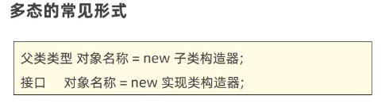

> 这样的适用范围更大，其实跟写子类类型是一样的，但是写父类类型适用性更广

- 静态多态

1. 静态多态又称编译时多态，如方法的重载；

- 动态多态

1. 动态多态又称运行时多态，系统根据调用该方法的实例类型，来决定选择调用哪个方法；这种多态存在的前提是：一要有继承关系；二要子类重写父类相关方法；三是父类引用指向子类对象。

```Java
// 定义一个抽象类 Animal
abstract class Animal {
  abstract void makeSound();
}

// 创建两个具体的类，分别继承 Animal 类
class Dog extends Animal {
  void makeSound() {
    System.out.println("汪汪汪");
  }
}

class Cat extends Animal {
  void makeSound() {
    System.out.println("喵喵喵");
  }
}

// 定义一个函数，该函数接受一个 Animal 类型的参数
public static void makeSound(Animal animal) {
  animal.makeSound();
}

// 使用 makeSound 函数，传入不同的对象
public static void main(String[] args) {
  Animal dog = new Dog();
  Animal cat = new Cat();
  makeSound(dog);  // 输出：汪汪汪
  makeSound(cat);  // 输出：喵喵喵
}

```

java.lang.Object类是所有类的父类（根类、基类），它的引用变量可以引用任何对象或者null。

### 向上与向下转型

向上转型（Upcasting）和向下转型（Downcasting）是两种常见的类型转换操作。

1. 向上转型（Upcasting）：
   向上转型是指将一个子类对象转型为父类引用。这种转型是自动的，因为子类是父类的一个特例，所以总是可以安全地将子类对象视为父类对象。

   ```java
   Parent parent = new Child(); // 向上转型
   ```

   在向上转型之后，你可以通过父类引用调用在父类中声明的方法。如果这些方法在子类中被重写，那么将调用子类的实现。但是，你不能调用子类中新增的方法，因为父类引用不知道这些方法的存在。
2. 向下转型（Downcasting）：
   向下转型是指将一个父类对象转型为子类引用。这种转型不是自动的，因为不是所有的父类对象都是某个特定子类的实例。如果直接进行向下转型，而不进行类型检查，可能会导致`ClassCastException`​。

   ```java
   Child child = (Child) parent; // 向下转型
   ```

   在进行向下转型之前，通常需要使用`instanceof`​关键字来检查对象是否是目标类型的实例。

   ```java
   if (parent instanceof Child) {
       Child child = (Child) parent; // 安全的向下转型
   }
   ```

   成功进行向下转型后，你就可以通过子类引用调用子类特有的方法和属性了。
   向上转型和向下转型是多态中非常重要的概念，它们使得Java的继承体系更加灵活，可以写出更加通用的代码。但是，使用向下转型时必须小心，确保类型的正确性，以避免运行时异常。

‍

### 优势

- 需要更改实例化的对象时，可以直接更改调用的子类构造器，而无需更改下面调用的方法

```Java
        father s1=new sons1();
        father s2=new sons2();
        //调用各类中的方法
        s1.run();
        s2.run();
        
        >>>
        //依然调用的是子类的run方法可以减少代码的更改
        father s2=new newson3();
        father s1=new sons1();
        s1.run();
        s2.run();//无需更改
```

- 定义方法的时候，使用父类型作为参数，该方法就可以接收这父类的一切子类对象，体现出多态的扩展性与便利。

> 这里的参数是以数据类型的角度来看，有引用类型和基本类型.

father是对象所以是引用类型，会接收引用类型，并赋值给a,father的子类也可以传递进来，

```Java
    //限制只有father类和其子类才能传递
    void go(father a){

    }

```

### 多态中成员访问特点

#### 方法调用：编译看左边，运行看右边。

> 编译时会看father中有没有run方法，然后再去调用子类构造器，然后再调用子类中的run方法

```Java
//编译看       运行看
father s2=new sons2();
  s2.run(); ==sons2.run();

```

> 📌但是不能调用子类的独有方法，因为编译时father没有独有方法,后续由数据类型转化解决

#### 变量调用：编译看左边，运行也看左边。（多态侧重行为多态）

> 最终输出的还是父类的name，多态的变量调用

```Java
   public static void main(String[] args) {
        father s1=new sons1();
        father s2=new sons2();
//调用各类中的方法
        s1.run();
        s2.run();
        
        System.out.println(s1.name);
        System.out.println(s2.name);
```

```Java
package duotai;

public class father {
    public String name="toto";
    public void run(){};}
```

```Java
public class sons1 extends father {
 public String name="lala";
    @Override
    public void run(){
        System.out.println("sons1跑得快") }}

```

```Java
public class sons2 extends father{
  public String name="wawa";
    @Override
   public void run(){
        System.out.println("sons2跑得慢");}}

```

test测试类

```Java
package duotai;

public class test {
    public static void main(String[] args) {
        father s1=new sons1();
        father s2=new sons2();
//调用各类中的方法
        s1.run();
        s2.run();
        
        System.out.println(s1.name);
        System.out.println(s2.name);
    }

}
```

> 📌father s1=new sons1();   父类类型声明，调用子类的构造器，

### 类型转化

#### 自动类型转换（从子到父) :

子类对象赋值给父类类型的变量指向。

```Java
 father s1=new sons1();
```

#### 强制类型转换吗（从父到子)：

> 作用：可以解决多态下的劣势，可以实现调用子类独有的功能。

```Java
//此时必须进行强制类型转换：子类对象 变量=（子类）父类类型的变量
//强制类型转化  ,相当是把左边替换了
        sons1 s4=(sons1) s1;  >>>sons1 s4=new sons1();
        System.out.println(s4.name);


```

> 📌注意：如果转型后的类型和对象真实类型不是同一种类型，那么在转换的时候就会出现ClassCastException

> 📌编译阶段不会报错，但是运行阶段会报错，这个问题比较严重

#### 转换检测

> 为了防止出现强制类型转换的错误,使用 instanceof来判断当前对象的真实类型，再进行强制转换

用于传递的参数是引用类型 且不知道具体对象时 的转换

```Java
//变量名 instanceof 真实类型
        if (s4 instanceof father){
            System.out.println("true");
        }else System.out.println("false");


》》》true
```

> 📌判断关键字左边的变量指向的对象的真实类型，是否是右边的类型或者是其子类类型，是则返回true,反之。

```Java
 //ClassCastException  因为dog和sons1不是同一种类型
 dog s4=(sons1) s1;  >>>dog s4=new sons1();

```

# 内部类

* 静态内部类[了解]
* 成员内部类（非静态内部类）[了解]
* 局部内部类[了解]
* 匿名内部类（重点）

在Java中，内部类（Inner Class）是一种非常有用的特性，它允许你将一个类定义在另一个类的内部。内部类通常用于以下几种情况：

1. **成员内部类（Member Inner Class）**   ：
   成员内部类是最常见的内部类形式，它像外部类的一个成员一样，可以访问外部类的所有成员变量和方法，包括私有的。成员内部类不能包含任何static变量或方法。
2. **静态内部类（Static Nested Class）**   ：
   静态内部类与成员内部类类似，但它是静态的。静态内部类通常用于将一些相关的类组织在一起，以便于打包和访问控制。静态内部类可以包含静态和非静态成员。
3. **局部内部类（Local Inner Class）**   ：
   局部内部类定义在一个块中，如方法或作用域块。它们仅在该块执行时可见，并且可以访问该块内的final或effectively final变量。
4. **匿名内部类（Anonymous Inner Class）**   ：
   匿名内部类是没有名称的局部内部类，通常用于扩展一个类或实现一个接口，并且通常只用一次。

   ‍
5. 在学习内部类时，没有绝对的“最重要”的内部类类型，因为每种类型的内部类都有其特定的用途和优势。然而，从实用性的角度来看，**匿名内部类**和**成员内部类**可能是最常用的。

* **匿名内部类**通常用于事件处理、GUI编程和一些短暂的扩展操作，特别是在使用Java标准库中的接口时，如`Runnable`​、` ActionListener`​等。
* **成员内部类**则用于当内部类需要访问外部类的实例变量和方法时，它提供了一种将逻辑组织在一起的便捷方式。

> 内部类就是定义在一个类里面的类，里面的类可以理解成（寄生），外部类可以理解成（宿主）。内部类提供了更好的封装性，内部类本身就可以用private protectecd等修饰，封装性可以做更多控制。

### 静态内部类[了解]

> 跟普通的类是一样的，开发中使用的少

```Java
public class innerstaticclass {
    public static class inner{
        
    }
}
```

### 成员内部类（非静态内部类）[了解]

> JDK16之前，成员内部类中不能定义静态成员，JDK16开始也可以定义静态成员了。

```Java
public class innerstaticclass {
  private int z=10;
    public class inner{
         private int z=11;
    }
}
```

#### 内部类的对象创建

> 外部类名.内部类名对象名=new外部类构造器.new内部类构造器()

```Java
    innerstaticclass.inner neibu=new innerstaticclass().new inner();
```

无static修饰，属于外部类的对象。
可以直接访问外部类的静态成员，实例方法中可以直接访问外部类的实例成员。

```Java
public class innerstaticclass {
  private int z=10;
    public class inner{
         private int z=11;
         this.z//访问inner的
         innerstaticclass.this.z//访问外部类的z

    }
}


```

### 局部内部类[了解]

### 匿名内部类（重点）

> 本质上是一个没有名字的局部内部类，定义在方法中、代码块中、等。

作用：方便创建子类对象，最终目的为了简化代码编写。

场景：当只是用一次的时候，就没有必要写对象再创建再调用。直接new的同时去写方法体，由java帮我们实现继承

理解：匿名内部类的编译类型和运行时类型就可以理解。

匿名内部类是一种没有名称的内部类，它通常用于覆盖接口或类的方法。匿名内部类可以看作是一个继承了该类或实现了该接口的类的对象。

‍

以下是一个使用匿名内部类的示例：

* 编译时类型是：`EnemyBehavior`​
* 运行时类型：`enemy`​对象

```java
public class anno {
}
// 定义EnemyBehavior接口
interface EnemyBehavior {
    void move();
    void attack();
}

 class Game {
    public static void main(String[] args) {
        // 创建一个特殊的敌人并定义其独特行为（匿名内部类实现EnemyBehavior接口）
        EnemyBehavior enemy = new EnemyBehavior(){
            @Override
            public void move() {
                System.out.println("The special enemy sneaks towards the player.");
            }

            @Override
            public void attack() {
                System.out.println("The special enemy launches a surprise attack on the player!");
            }
        };

        System.out.println(enemy.getClass());

    }
}
```

‍

匿名内部类在Java底层输出的名字：`class Game$1`​

就是在类后面加$1

‍

JAVA底层帮我们做的事：

```java

class Game$1 implements EnemyBehavior {
        @Override
        public void move() {
            System.out.println("The special enemy sneaks towards the player.");
        }

        @Override
        public void attack() {
            System.out.println("The special enemy launches a surprise attack on the player!");
        }
}
```

匿名内部类通常用于事件处理、线程创建等场景，它们提供了一种简洁的方式来创建和使用一次性的、短小的类实现。

‍

#### 编译时类型（Static Type）

编译时类型是变量声明时的类型，它在编译阶段是可知的，并且在运行时不会改变。编译时类型决定了变量可以接受哪些类型的对象，以及可以对这些对象执行哪些操作。
例如：

```java
Animal animal = new Dog();
```

在这里，`animal`​的编译时类型是`Animal`​。

#### 运行时类型（Runtime Type）

运行时类型是实际对象的类型，它是在运行时确定的，并且可以不同于编译时类型。运行时类型决定了对象可以执行哪些操作。
在上面的例子中，`animal`​的运行时类型是`Dog`​。

#### 判断编译时类型和运行时类型

你可以使用以下方法来判断一个对象的编译时类型和运行时类型：

1. **判断编译时类型**：

   * 通过变量的声明类型来判断。在上述例子中，`animal`​的编译时类型是`Animal`​。
2. **判断运行时类型**：

   * 使用`instanceof`​运算符来检查对象的运行时类型。
   * 使用`getClass()`​方法来获取对象的运行时类型。
     例如：

```java
Animal animal = new Dog();
// 使用instanceof检查运行时类型
if (animal instanceof Dog) {
    System.out.println("animal的运行时类型是Dog");
}
// 使用getClass()获取运行时类型
Class<?> runtimeType = animal.getClass();
System.out.println("animal的运行时类型是：" + runtimeType.getName());
```

在这个例子中，`instanceof`​运算符检查`animal`​是否是`Dog`​类的实例，而`getClass()`​方法返回对象的运行时类型，即`Dog`​类的`Class`​对象。
需要注意的是，编译时类型决定了变量可以调用哪些方法，而运行时类型决定了实际调用哪个方法。如果子类重写了父类的方法，那么调用时会根据对象的运行时类型来决定调用哪个方法，这就是多态的表现。

‍

# 常用API

### toString返回对象堆内存地址

> : 类的全限名@地址.    默认下直接输出一个变量就是调用了 对象的toString方法，可以在子类中重写然后输出我们想要的内容

```Plain
object.toString();
```

> 主要作用toString还是为了重写，方便我们直接输出对象

```Java
public class api1 {
    String namee="";

    @Override
    public String toString() {
        return "api1{" +
                "namee='" + namee + '\'' +
                '}';
    }

    public api1() {
    }

    public api1(String namee) {
        this.namee = namee;
    }
}

class test{
    public static void main(String[] args) {
        api1 t=new api1("张三");
        System.out.println(t);

    }

}


```

### equals比较对象

> 默认是比较对象的地址，但实际中是重写用来比较对象的内容是否相等

```Java
import java.util.Objects;

public class api_equals {
    String name;
    int age;

    @Override
    public boolean equals(Object o) {
        if (this == o) return true;
        if (o == null || getClass() != o.getClass()) return false;
        api_equals that = (api_equals) o;
        return age == that.age && Objects.equals(name, that.name);
    }

    public api_equals() {
    }
    public api_equals(String name, int age) {
        this.name = name;
        this.age = age;
    }
}

class test2{
    public static void main(String[] args) {
        api_equals a1=new api_equals("张三",18);
        api_equals a2=new api_equals("张三",18);
        api_equals a3=new api_equals("张三",19);
        System.out.println("a1和a2对象类型和值是否相等："+a1.equals(a2));
        System.out.println("a2和a3对象类型和值是否相等："+a2.equals(a3));
    }

}
```

### Object.isNull判断对象是否为空

> 两个完全是一样的，只是调用api比较装

```Java
        System.out.println(Objects.isNull(a1));
        System.out.println(a1 = null);
```

‍

# 正则表达式

> 用来校验用户输入的一些数据规则，比如注册时的账号密码

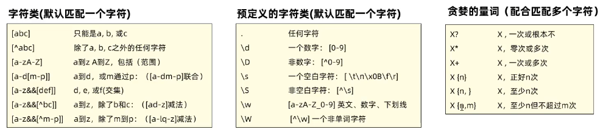

字符串对象提供了匹配正则表达式规则的API


```Java
   System.out.println("a".matches("^abc"));  //验证内容 ，验证规则
```

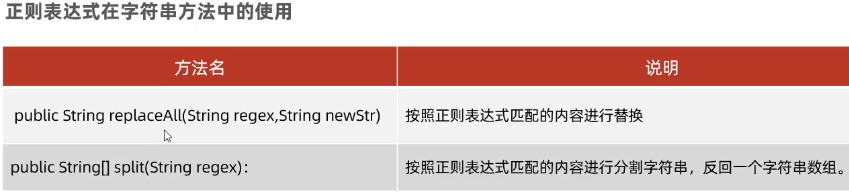

‍

# 注解

注解(Annotation)也被称为元数据(Metadata),用于修饰解释包、类、方法、属性、构造器、局部变量等数据信息。

和注释一样，注解不影响程序逻辑，但注解可以被编译或运行，相当于嵌入在代码中的补充信息。

在JavaSE中，注解的使用目的比较简单，例如标记过时的功能，忽略警告等。

在JavaEE中注解占据了更重要的角色，例如用来配置应用程序的任何切面，代替java EE旧版中所遗留的繁冗代码和XML配置等。

‍

使用Annotation时要在其前面增加@符号，并把该Annotation当成一个修饰符使用。用于修饰它支持的程序元素

‍

三个基本的Annotation:

* @Override:限定某个方法，是重写父类方法，该注解只能用于方法

  源码：

  ```java
  	@Target(ElementType.METHOD)
  	@Retention(RetentionPolicy.SOURCE)
  	public @interface Override {
  	}
  ```
* @Deprecated:用于表示某个程序元素（类，方法等）已过时

  给方法或者便令添加后进行调用就会有个删除线

  ```java
  	@Deprecated
      void move();
  ```

  ```java
  @Documented
  @Retention(RetentionPolicy.RUNTIME)
  @Target(value={CONSTRUCTOR, FIELD, LOCAL_VARIABLE, METHOD, PACKAGE, MODULE, PARAMETER, TYPE})
  public @interface Deprecated {
  ```
* @SuppressWarnings:抑制编译器警告

  ​`@SuppressWarnings`​注解在Java中用于抑制编译器警告。以下是一个简单的例子，我们在创建ArrayList时未指定泛型，这通常会引发"Unchecked assignment"或"Raw type"警告，但通过使用`@SuppressWarnings`​注解可以忽略这些警告：

  ```java
  import java.util.ArrayList;

  public class SuppressWarningsExample {

      public static void main(String[] args) {
          // 不使用@SuppressWarnings时，此处会有一个"Unchecked assignment"警告
          ArrayList list = new ArrayList();

          // 使用SuppressWarnings注解来抑制警告
          @SuppressWarnings("unchecked")
          ArrayList<String> suppressedList = new ArrayList();

          list.add("Hello");
          suppressedList.add("World");

          System.out.println(list);
          System.out.println(suppressedList);
      }
  }
  ```

  在上述代码中，对`suppressedList`​的创建和赋值使用了`@SuppressWarnings("unchecked")`​注解，这意味着即使我们没有为ArrayList指定泛型（即创建了一个原始类型的ArrayList），编译器也不会发出警告。但是请注意，尽管警告被抑制，运行时类型安全问题仍然可能存在，因此在实际编码中应尽量避免使用原始类型并明确指定泛型。

  ```java
  @Retention(RetentionPolicy.SOURCE)
  public @interface SuppressWarnings {
  ```

‍

@interface是表示说明

@Target是修饰注解的注解，称为元注解

‍

# 异常

在Java中，异常处理是一种用于处理程序中错误和异常情况的重要机制。Java的异常处理是通过五个关键字来实现的：`try`​、`catch`​、`finally`​、`throw`​和`throws`​

‍

> 当我们认为某一段代码有可能会出现异常我们可以提前用异常来处理，保证程序的可用性。

IDEA快捷键：选中代码后 CTRL+ALT+T

### 异常的分类

Java中的异常主要分为两大类：`Error`​和`Exception`​。

* ​`Error`​：指的是Java运行时系统的内部错误和资源耗尽错误。这类错误比较严重，应用程序通常无法恢复，例如`OutOfMemoryError`​。
* ​`Exception`​：它又分为两大类(**运行时异常**和**编译时异常**)，`RuntimeException`​和非`RuntimeException`​（也称为`Checked Exception`​）。

  * ​`RuntimeException`​：如数组越界访问`ArrayIndexOutOfBoundsException`​、空指针异常`NullPointerException`​等。这类异常是程序设计错误导致的，Java编译器不会检查这些异常。
  * ​`Checked Exception`​：如`IOException`​、`SQLException`​等。这类异常是Java编译器强制要求程序员必须进行处理的异常。

‍

> 编译异常必须处理，而运行时异常如果没有处理默认是throws向上传递到JVM中

‍

### 异常体系图（重要）

​​

‍

​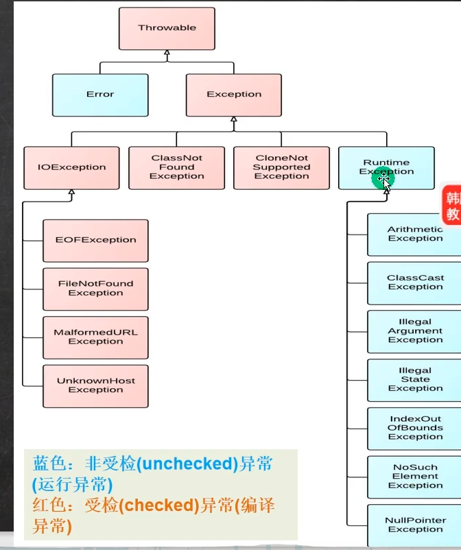​

‍

throw向上扔的过程

​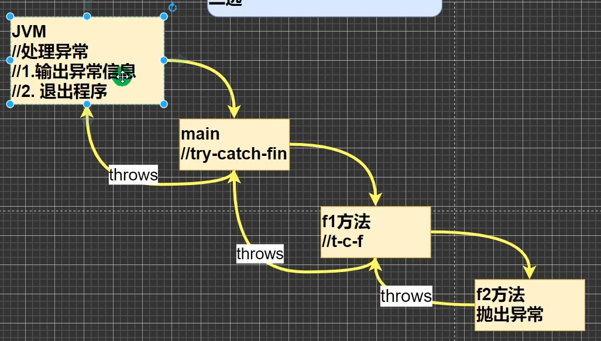​

### 异常处理的关键字

> ​`try-catch-finally`​和`throw`​二选一即可。
>
> 默认类是写有throw，所以报错时才会输出错误。没有显示的处理异常，就是JVM来处理。

* ​` try-catch-finally`​​

  * ​`try`​​块：用来包围可能会产生异常的代码。它后面必须跟至少一个`catch`​​块或者一个`finally`​​块。
  * ​`catch`​​块：用来捕获`try`​​块中发生的异常，并对异常进行处理，可以有多个，子类异常写在前面，父类写在后面。
  * ​`finally`​​块：无论是否捕获或处理异常，`finally`​​块中的代码都会被执行。通常用于释放资源，如关闭文件流。
* ​`throw`​​语句：用来明确地抛出一个异常。
* ​`throws`​​子句：用在方法签名中，以声明该方法可能会抛出的异常。
* 两者区别

  ​`throw`​和`throws`​在Java中都是与异常处理相关的关键字，但它们的作用不同：

  1. ​`throw`​：用于主动抛出一个异常对象。当程序中发生错误或满足某种条件时，我们可以使用`throw`​关键字手动抛出一个异常。

  示例：

  ```java
  public class ThrowExample {
      public static void main(String[] args) {
          try {
              throw new IllegalArgumentException("Invalid argument!");
          } catch (IllegalArgumentException e) {
              System.out.println("Caught an exception: " + e.getMessage());
          }
      }
  }
  ```

  在这个例子中，我们使用`throw`​关键字主动抛出了一个`IllegalArgumentException`​异常，然后在try-catch块中捕获并处理了这个异常。

  2. ​`throws`​：用于声明一个方法可能会抛出的异常类型。当一个方法不能处理某个检查型异常时，它可以使用`throws`​关键字将异常声明在其方法签名中，从而将处理异常的责任转移给方法的调用者。

  示例：

  ```java
  public class ThrowsExample {
      public void readFile(String filePath) throws FileNotFoundException {
          File file = new File(filePath);
          if (!file.exists()) {
              throw new FileNotFoundException("File not found: " + filePath);
          }
          // ... read the file here
      }

      public static void main(String[] args) {
          ThrowsExample example = new ThrowsExample();
          try {
              example.readFile("nonexistent_file.txt");
          } catch (FileNotFoundException e) {
              System.out.println("Caught an exception: " + e.getMessage());
          }
      }
  }
  ```

  ‍

‍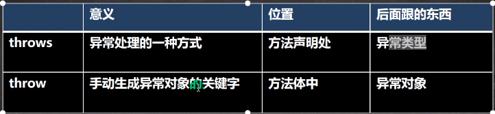​

‍

‍

‍

特殊：

​`try-finally`​:不捕获异常，而是执行其他的业务逻辑。允许程序崩溃或退出。

‍

‍

‍

### 异常处理的基本模式（重要）

```java
try {
    // 可能会发生异常的代码
} catch (特定异常类型1 e) {
    // 处理异常
} catch (特定异常类型2 e) {
    // 处理异常
} finally {
    // 清理代码，无论是否发生异常都会执行
}
```

### 示例

```java
public class ExceptionExample {
    public static void main(String[] args) {
        try {
            int[] myArray = {1, 2, 3};
            System.out.println(myArray[3]); // 这里会抛出ArrayIndexOutOfBoundsException
        } catch (ArrayIndexOutOfBoundsException e) {
            System.out.println("数组越界了！");
        } finally {
            System.out.println("这是finally块中的代码，总会被执行。");
        }
    }
}
```

在上述代码中，尝试访问数组的一个不存在的元素将导致`ArrayIndexOutOfBoundsException`​。这个异常被`catch`​块捕获，并输出相应的错误信息。`finally`​块中的代码无论如何都会被执行。

### 最佳实践

* 不要使用异常来控制正常的程序流程。
* 尽量捕获最具体的异常类型，而不是使用过于宽泛的异常类型。
* ​`finally`​块中避免使用返回语句或抛出异常，因为这会覆盖try或catch块中的返回值或异常。
* 当一个方法可能抛出多个检查异常时，可以声明方法抛出多个异常。
  理解并正确使用Java的异常处理机制对于编写健壮、可靠的应用程序至关重要。

‍

### 常见的异常

以下是五个常见的Java异常，包括运行时异常（RuntimeException）和编译时异常（非RuntimeException）：

1. RuntimeException - 运行时异常

   * ​`NullPointerException`​（空指针异常）：当应用程序试图访问空对象的成员变量或方法时抛出。
   * ​`ArrayIndexOutOfBoundsException`​（数组索引越界异常）：当应用程序试图访问数组的非法索引时抛出。
   * ​`ArithmeticException`​（算术异常）：当出现异常的算术条件时抛出，如除以零。
2. ClassNotFoundException - 编译时异常

   * 当应用程序试图加载类时，如果找不到类的定义，则抛出此异常。
3. IOException - 编译时异常

   * 输入/输出异常的通用超类，当发生某种I/O问题（如文件不存在或网络连接失败）时抛出。
4. SQLException - 编译时异常

   * 当在数据库访问过程中发生错误时抛出，例如查询失败或违反数据库约束。
5. ServletException - 编译时异常

   * 当在Servlet中发生错误时抛出，用于指示Servlet遇到了问题。
     这些异常代表了Java中不同类型的错误情况，从运行时错误（如空指针或数组越界）到更具体的错误，如类找不到、I/O问题、数据库错误和Servlet错误。在编写Java应用程序时，了解这些异常及其含义对于正确处理错误情况至关重要。

‍

### try catch （重要）

让用户输入一个整数，如果不是就一直循环。

```java
package Abnormal;

import java.util.Scanner;

public class TryCatch {
//    案例：让用户输入一个整数，如果不是就一直循环。

    public static void main(String[] args) {
        System.out.println("年龄是："+GetUserAge());
    }
  
public static int GetUserAge(){
    Scanner sc=new Scanner(System.in);
    //调用功能
    System.out.println("请输入年龄");
    //Int表示接的是整数
    int Age = 0;
    try {
         Age = sc.nextInt();
         return Age; // 在这里返回年龄
    } catch (Exception e) {
        System.out.println("请输入整数哦");
        GetUserAge();
    }finally {
        sc.close(); // 关闭资源
    }

    //默认返回0
    return Age;
}


}

```

‍

### throws抛出 （重要）

子类重写父类的方法时，对抛出异常的规定：子类重写的方法，

所抛出的异常类型要么和父类抛出的异常一致，要么为父类抛出的异常类型的子类型

‍

#### 继承中的异常设置规则

在Java中，当子类重写父类的方法时，关于异常抛出的规则是这样的：

1. 子类方法可以抛出与父类方法相同的异常。
2. 子类方法可以抛出父类方法抛出异常的子类型。
3. 子类方法不能抛出比父类方法更多种类的检查异常（即编译时异常）。
   下面是一个简单的示例，展示了这些规则：

```java
// 父类
class ParentClass {
    // 父类方法抛出 IOException
    void method() throws IOException {
        // 方法体
    }
}
// 子类
class ChildClass extends ParentClass {
    // 子类重写方法，抛出 IOException 的子类型 FileNotFoundException
    @Override
    void method() throws FileNotFoundException {
        // 方法体
    }
}
// 另一个子类
class AnotherChildClass extends ParentClass {
    // 子类重写方法，抛出与父类相同的异常 IOException
    @Override
    void method() throws IOException {
        // 方法体
    }
}
// 错误的子类，因为抛出了父类方法没有声明的新的检查异常
class IncorrectChildClass extends ParentClass {
    // 子类重写方法，错误地抛出了新的检查异常 SQLException
    // 这会导致编译错误，因为 SQLException 不是 IOException 的子类型
    // void method() throws SQLException {
    //     // 方法体
    // }
}
```

在这个例子中，`ChildClass`​正确地重写了`ParentClass`​的`method`​方法，抛出了`IOException`​的子类型`FileNotFoundException`​。`AnotherChildClass`​也正确地重写了方法，抛出了与父类相同的异常`IOException`​。而`IncorrectChildClass`​尝试抛出一个新的检查异常`SQLException`​，这不是`IOException`​的子类型，所以这会导致编译错误。

‍

以下是一些使用`throws`​的关键场景：

1. 当我们在方法内部无法确定如何处理或者没有权限处理某种检查型异常（即非运行时异常，如IOException、SQLException等）时，需要将这些异常通过`throws`​声明抛出。

示例：

```java
public class FileReader {
    public void readFile(String filePath) throws FileNotFoundException {
        File file = new File(filePath);
        if (!file.exists()) {
            throw new FileNotFoundException("File not found: " + filePath);
        }
        // ... read the file here
    }
}
```

在这个例子中，`readFile`​方法可能会抛出`FileNotFoundException`​，因此我们使用`throws`​将其声明出来。这样，当调用此方法时，调用者必须处理这个异常，否则也需要在方法签名上声明抛出该异常。

‍

### 细节

1. 对于**编译异常**，程序中必须处理，比如try-catch或者throws
2. 对于运行时（runtimeexp）异常，程序中如果没有处理，默认就是throws的方式处理[举例]
3. 子类重写父类的方法时，对抛出异常的规定：子类重写的方法，所抛出的异常类型要么和父类抛出的异常一致，要么为父类抛出的异常的类型的子类型[举例]
4. 在throws过程中，如果有方法try-catch,就相当于处理异常，就可以不必throws

‍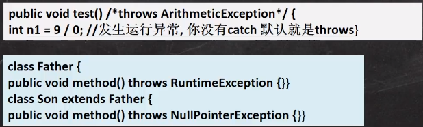​

‍

‍

### 自定义异常

> 一般是进程运行时异常，因为可以继承默认的异常处理机制，不需要我们写太多，也更方便。

在Java中，你可以创建自己的运行时异常类，通常继承自`java.lang.RuntimeException`​。下面是一个简单的自定义运行时异常类的例子，它会输出在构造函数中传入的字符串信息：

```java
class CustomRuntimeException extends RuntimeException {
    public CustomRuntimeException(String message) {
        super(message); // 调用父类的构造函数，将message传递给异常对象
        System.out.println("CustomRuntimeException caught with message: " + message);
    }
}

// 使用自定义异常的示例
public class Main {
    public static void main(String[] args) {
        try {
            throw new CustomRuntimeException("This is a custom exception message.");
        } catch (CustomRuntimeException e) {
            // 在这里你可以选择处理这个异常，但在自定义异常中已经打印了消息
            e.printStackTrace(); // 打印异常栈跟踪
        }
    }
}
```

当你运行这段代码时，它首先会抛出一个新的`CustomRuntimeException`​实例，并在构造函数中输出传入的字符串信息，然后在catch块中会输出异常栈跟踪信息。注意，由于`CustomRuntimeException`​继承自`RuntimeException`​，所以无需在方法签名上使用`throws`​关键字来声明抛出异常。

‍

# 常用类

## 包装类 Wapper

> 满足一切皆对象事项，后期的集合和泛型都不支持基本类型，只能用包装类

​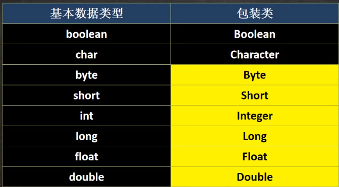​

* 引用类型和基本类型可以相互转化。直接赋值就会自动转化
* 可以将值赋值为null
* 可以直接调用toString转为字符串
* 将字符串转为其他数据的类型（重要）

‍

Boolean和Character是直接继承Object和Ser..和Com

数字类型是多了一层Number类

​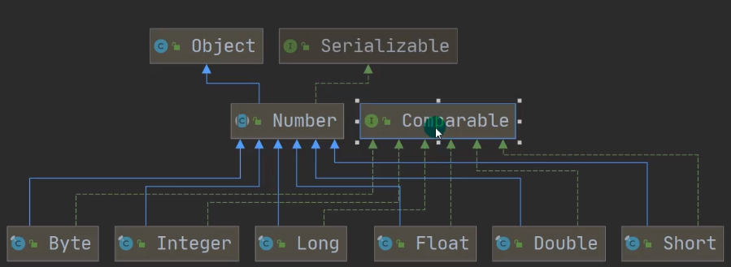​

‍

### 包装类和基本类型的转换

基本类型——>包装类  ：这个过程叫装箱

包装类——>基本类型 ：这个过程叫装箱

‍

在JDK5之前是手动装箱，在JDK5及之后是自动装箱。**自动装箱的本质还是调用intValue等方法。**

​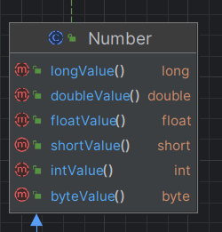​

#### 手动装箱：

‍

​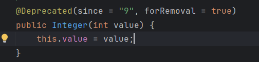​

```java
// 原始数据类型变量
int primitiveInt = 10;

// 手动装箱：使用构造函数将基本数据类型转换为包装类对象在 jdk1.9已经移除
Integer wrapperInt1 = new Integer(primitiveInt);

// 或者使用valueOf静态方法进行装箱
Integer wrapperInt2 = Integer.valueOf(primitiveInt);
```

#### 手动拆箱：

```java

// 手动拆箱：使用包装类对象的intValue()方法将包装类对象转换回基本数据类型
int primitiveValue = wrapperInt.intValue();
```

#### 自动装箱与拆箱：

自Java SE 5开始，引入了自动装箱与拆箱机制，使得编译器能自动进行基本类型和包装类之间的转换。

```java
// 自动装箱
Integer wrapperInt3 = 30; // 这里实际上是由编译器隐式执行Integer.valueOf(30)

// 自动拆箱
int anotherPrimitive = wrapperInt3; // 这里实际上是编译器隐式执行wrapperInt3.intValue()
```

‍

### 包装类之间的转换

在Java中，可以通过包装类提供的各种方法将字符串和整数包装类进行转换。

#### 将字符串转换为整数包装类（Integer）：

```java
String str = "123";
// 使用Integer类的parseInt静态方法转换为int，然后通过Integer.valueOf方法装箱为Integer对象
Integer num = Integer.valueOf(Integer.parseInt(str));
System.out.println(num); // 输出：123

// 或者直接使用Integer类的valueOf静态方法，它会自动解析字符串为整数
Integer num2 = Integer.valueOf(str);
System.out.println(num2); // 输出：123
```

#### 将整数包装类（Integer）转换为字符串：

```java
Integer number = 456;
// 使用Integer类的toString方法将Integer对象转换为字符串
String strNum = number.toString();
System.out.println(strNum); // 输出："456"
```

#### 示例完整代码：

```java
public class ConversionExample {
    public static void main(String[] args) {
        String str = "123";
        Integer integer = Integer.valueOf(str);
        System.out.println(integer);

        Integer number = 456;
        String strNumber = number.toString();
        System.out.println(strNumber);
    }
}
```

‍

‍

### 包装类常用方法

在IDEA中可以查看到类的方法和类图

​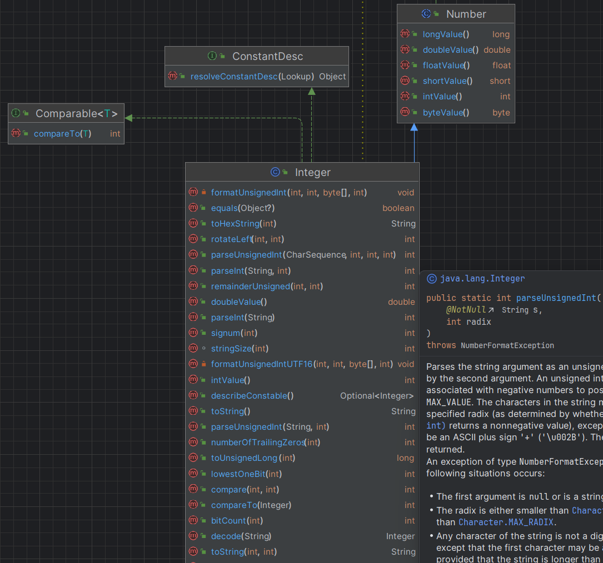​

‍

1. 构造方法：

   * ​`Integer(int value)`​：创建一个表示指定整数值的Integer对象。
   * ​`Integer(String s)`​：尝试将字符串参数解析为一个整数并创建对应的Integer对象。
2. 常量：

   * ​`MIN_VALUE`​：表示int类型所能表示的最小值，即-2^31。
   * ​`MAX_VALUE`​：表示int类型所能表示的最大值，即2^31 - 1。
   * ​`SIZE`​：int类型在二进制补码形式下表示值所需要的位数，即32位。
   * ​`BYTES`​：int值所占用的字节数，对于int来说是4字节。
3. 转换方法：

   * ​`int intValue()`​：返回封装的int基本类型值。
   * ​`static int parseInt(String s)`​：从字符串中解析并返回整数值。
   * ​`static Integer valueOf(int i)`​：将int值转换为Integer对象，相当于装箱操作。
   * ​`static Integer valueOf(String s)`​：将字符串解析成Integer对象，如果不能转换则抛出NumberFormatException。
   * ​`static String toString(int i)`​：将int值转换为字符串表示。
4. 其他实用方法：

   * ​`boolean equals(Object obj)`​：测试此Integer对象与指定对象是否相等。
   * ​`int compare(Integer anotherInteger)`​：根据数字值比较两个Integer对象。
   * ​`static int bitCount(int i)`​：计算i的二进制表示中1的个数。
   * ​`static int toUnsignedLong(int i)`​：将int值作为无符号long值返回。
   * ​`static Integer decode(String nm)`​：解码代表整数的字符串。
5. 数学运算方法：

   * ​`static int sum(int a, int b)`​：返回a和b之和。
   * ​`static int max(int a, int b)`​：返回a和b中的较大值。
   * ​`static int min(int a, int b)`​：返回a和b中的较小值。

请注意，上述列表并非Integer类的所有方法，但涵盖了大部分常用的API。随着Java版本的更新，可能还有更多方法可用。

‍

### 用法

跟基本数据一样

```Java
Integer a=15; 

Integer a=null; 

        //将字符串转化成数形
        String num1="66";
        int a =Integer.parseInt(num1);
        //用valueOf更简单
        int a1 =Integer.valueOf(num1);
        //其他的类型也是一样
        String  num2="19.9";
        double d1=Double.parseDouble(num2);
        double d2=Double.valueOf(num2);
        System.out.println(a+"**"+d1);
        System.out.println(a1+"**"+d2);


//相互转化
int a1=a;
```

‍

### 细节

包装类的实现又两种 new的方式以移除

1. ​` Integer j= new Integer(12);`​
2. ​`Integer m=1`​

直接赋值的范围是-127：128  ，底层的`.valueOf`​

否则就是new 的形式

‍

## String类

> 不可修改：是指字符对象的引用地址不可修改，但是**单个字符**的值可以修改。

String对象用于保存字符串，也就是一组字符序列

字符串常量对象是用双引号括起的字符序列。例如："你好”、"12.97"、"boy"等

字符串的字符使用Unicode字符编码，一个字符（不区分字母还是汉字）占两个字节。

​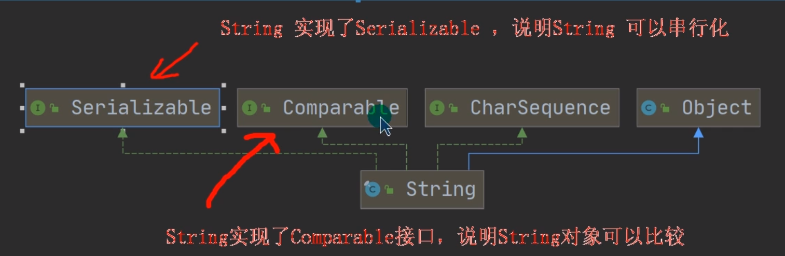​

‍

> java.lang.String类代表字符串，String类定义的变量可以用于指向字符串对像，然后操作该字符串。

* 创建后不可变内容，更改是创造了新的空间进行存储，并且把String对象地址指向新的地址

​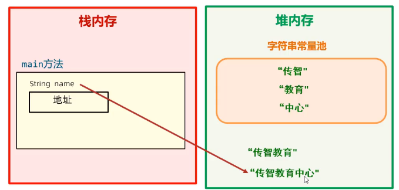​

* 直接输出String对象也可以输出结果是因为jvm的优化结果

```Java
//声明的几种方式 

String name="asdsa"

//几乎不用
String name=new String()

```

```Java
//当创建的内容一样的时候，变量池中就不会在开辟新的空间进行存储，而是将namee
//的地址指向了name


String name="asdsa"

String namee="asdsa"

```

* 以“”方式给出的字符串对象，在字符串常量池中存储，而且相同内容只会在其中存储一份。
* 字符串常量值是建再堆内存中的一个对象空间。
* 通过构造器new对象，每new一次都会产生一个新对象，放在堆内存中。并会存到字符串常量池中

​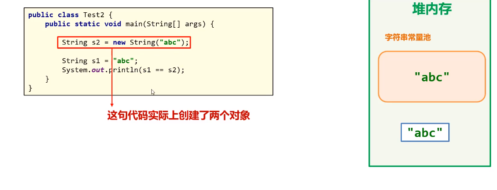​

‍

‍

String类实现了

* 接口Serializable【String可以串行化：可以在网络传输】
* 接口Comparable[String对象可以比较大小]

‍

底层是：byte数组

```python
 @Stable
    private final byte[] value;
```

‍

### 构造器

在类图中有显示有非常多的构造器

​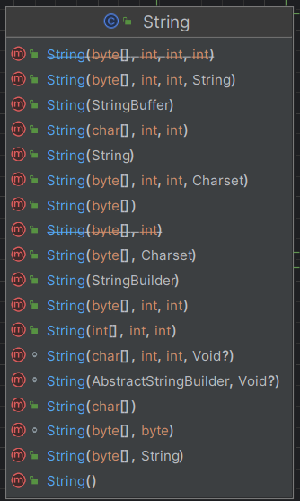​

‍

‍

常用的有：

1. String s2 new= string(String original);
2. String s3 =new String(char[]a);
3. String s4=new String(char[]a,int startIndex,int count)
4. String s5 new =String(byte[]b)

‍

‍创建方式：

1. 直接赋值 ` String s1="sadasd";`​

    方式一：**先从常量池查看**是否有"`sadasd`​”数据空间，如果有，直接指向；如果没有则重新创建，然后指向。S最终指向的是常量池的空间地址
2. 调用构造器 `String s2=new String("sdasdsa");`​

    方式二：**先在堆中创建空间**，里面维护了value属性，指向常量池的hsp空间。如果常量池没有"hsp",重新创建，如果有，直接通过value指向。最终指向的是堆中的空间地址。

​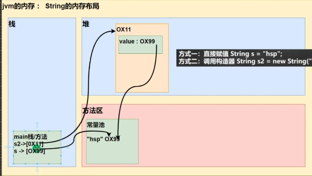​

‍

‍

### String常用的方法

#### equals方法

> 用于字符串内容之间的比较

```Java
    public static class Stringtesr{

        String okname="asd";
        String okpassword="aa";

        public void test(){
            Scanner sc=new Scanner(System.in);
            System.out.println("输入名字");
           String name=sc.next();
            System.out.println("请输入密码");
           String password=sc.next();

            if(okname.equals(name)&&password.equals(okpassword)){
                System.out.println("登入成功");
            }else {
                System.out.println("账号或密码错误");
            }


        }


    }


```

#### equalsIgnoreCase

> 忽略大小写进行字符串之间的比较

```Java
    public void img(){
            String name="Asd";
            System.out.println(okname.equalsIgnoreCase(name));

        }
```

#### charAt索引

> 获取某个索引位置处的字符,可以通过索引来遍历输出所有的字符

```Java
String name="asdsa"
char c=name.charAt(1)
            char c=name.charAt(1);
            System.out.println("第一个字符是"+c);

```

#### toCharArray()将字符串转化为字符数组

```Java
char[]chars= name.toCharArray();
for (int i 0;i<chars.length;i++){
char ch= chars[i];
System.out.println(ch);
}
```

#### substring(int index ,int end index)

> 截取字符串,会产生新的字符串，原来的字符串不变，需要去接收

```Java
//语法,可以只写开头，会截取到最后
字符串.substring(begin index,endindex)


name2.substring(4,9);

```

#### replace替换

> 会产生新的字符串，原来的字符串不变，需要去接收

```Java
String name3="金三胖是最厉害的80后，金三胖棒棒的！我好爱金三胖"；

name3.replace(target:"金三胖"，replacement:"**");
```

#### contains

查询是否包含,返回值是布尔型

```Java
System.oUt.println(name3.contains("金三胖"))；//trUe
System.out.println(name3.contains("金二胖"))；//false
```

‍

#### split分隔

以某个符号或者某个字符进行分割

```java
public class SplitExample {
    public static void main(String[] args) {
        // 示例1：使用单个字符分隔符
        String str1 = "one,two,three,four";
        String[] arr1 = str1.split(",");
        for (String s : arr1) {
            System.out.println(s);
        }

        // 示例2：使用字符串分隔符
        String str2 = "apple;banana;cherry";
        String[] arr2 = str2.split(";"); // 使用分号";"作为分隔符
        for (String s : arr2) {
            System.out.println(s);
        }

        // 示例3：使用正则表达式分隔符
        String str3 = "one1two2three3four";
        String[] arr3 = str3.split("\\d"); // 使用正则表达式匹配数字来分隔
        for (String s : arr3) {
            System.out.println(s);
        }

        // 示例4：限制分割次数
        String str4 = "one,two,three,four";
        String[] arr4 = str4.split(",", 3); // 最多分割成3个部分
        for (String s : arr4) {
            System.out.println(s);
        }
    }
}

```

‍

#### format格式化字符串

`format`方法的使用非常灵活，可以用来格式化各种数据类型，包括整数、浮点数、字符串、日期等。格式化字符串可以包含格式说明符，如`%s`（字符串）、`%d`（整数）、`%f`（浮点数）等，以及各种标志、宽度、精度和转换字符来控制输出的格式。

```java
public class FormatExample {
    public static void main(String[] args) {
        // 示例1：格式化字符串
        String formattedString = String.format("Hello, %s!", "World");
        System.out.println(formattedString); // 输出：Hello, World!
        // 示例2：格式化整数
        int number = 42;
        formattedString = String.format("The answer to life, the universe, and everything is %d.", number);
        System.out.println(formattedString); // 输出：The answer to life, the universe, and everything is 42.
        // 示例3：格式化浮点数
        double pi = 3.14159;
        formattedString = String.format("The value of pi is approximately %.2f.", pi);
        System.out.println(formattedString); // 输出：The value of pi is approximately 3.14.
        // 示例4：格式化货币
        double amount = 1234567.89;
        formattedString = String.format("The amount is %,.2f dollars.", amount);
        System.out.println(formattedString); // 输出：The amount is 1,234,567.89 dollars.
        // 示例5：使用索引
        formattedString = String.format("The %2$s, %1$s, and %3$s.", "quick", "brown", "fox");
        System.out.println(formattedString); // 输出：The brown, quick, and fox.
        // 示例6：格式化日期和时间
        Date now = new Date();
        formattedString = String.format("Current date and time: %tc", now);
        System.out.println(formattedString); // 输出当前日期和时间
    }
}
```

‍

## StringBuffer类

‍

​`StringBuffer`​类是Java中的一个可变字符序列，它提供了比`String`​类更强大的字符串操作功能。`StringBuffer`​对象在创建后可以被修改，底层实现是chat数组，没有添加final。

```java
abstract sealed class AbstractStringBuilder implements Appendable, CharSequence
    permits StringBuilder, StringBuffer {
    /**
     * The value is used for character storage.
     */
    byte[] value;

    /**
     * The id of the encoding used to encode the bytes in {@code value}.
     */
    byte coder;
```

这种特性使得`StringBuffer`​在进行大量字符串操作时比`String`​更有效率，因为它避免了创建不必要的中间字符串对象。

‍

​`StringBuffer`​类的一些关键特点包括：

1. **线程安全**：`StringBuffer`​是线程安全的，它的所有公共方法都是同步的，这意味着可以在多线程环境中安全地使用它而不用担心线程干扰。
2. **可变性**：`StringBuffer`​对象在创建后可以添加、删除或修改字符序列。
3. **容量**：`StringBuffer`​有一个初始容量，当需要时它会自动扩展以容纳更多的字符。这种自动扩容的机制是通过内部维护一个字符数组来实现的。
4. **性能**：由于`StringBuffer`​是可变的，对于涉及大量字符串操作的情况（如字符串拼接），它通常比`String`​更高效。

‍

### 构造器

​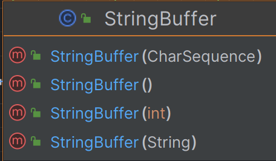​

​`StringBuffer`​类提供了多个构造器来创建`StringBuffer`​对象。以下是四个常用的构造器的简单介绍：

1. ​`StringBuffer(CharSequence seq)`​：传递一个`String`​对象或者其他任何实现`CharSequence`​接口的对象来创建一个`StringBuffer`​。

    ​`CharSequence`​是一个接口，`String`​类和`StringBuffer`​类都实现了这个接口  

    ```java
    CharSequence seq = "hello";
    StringBuffer stringBuffer = new StringBuffer(seq);
    ```
2. ​`StringBuffer()`​:其初始容量为16个字符。这是`StringBuffer`​的默认容量，足够小以减少初始内存消耗，同时在需要时可以自动扩容。

    ```java
    StringBuffer stringBuffer = new StringBuffer();
    ```
3. ​`StringBuffer(int capacity)`​:其初始容量由参数`capacity`​指定。这个构造器允许你在创建`StringBuffer`​时就设置一个更大的初始容量，以减少在添加大量字符时自动扩容的次数。

    ‍

    ```java
    StringBuffer stringBuffer = new StringBuffer(100);
    ```
4. ​`StringBuffer(String str)`​:  
    它包含与指定的`String`​对象相同的字符。这个构造器实际上调用了`StringBuffer(CharSequence seq)`​构造器。  
    示例：

    ```java
    String str = "hello";
    StringBuffer stringBuffer = new StringBuffer(str);
    ```

在选择构造器时，你应该根据你的具体需求来决定使用哪一个。如果你知道你的`StringBuffer`​最终会包含很多字符，那么使用指定容量的构造器可能会更有效率。如果你只是需要从一个现有的字符串或`CharSequence`​创建一个`StringBuffer`​，那么使用相应的构造器会更方便。

‍

‍

### 常用操作

​`StringBuffer`​类提供了一系列方法来进行字符串操作，包括：

* ​`append(String str)`​: 将指定的字符串追加到此字符序列。
* ​`insert(int index, String str)`​: 将指定的字符串插入到此字符序列中。
* ​`delete(int start, int end)`​: 删除此序列的子字符串中的字符。
* ​`reverse()`​: 导致该字符序列被序列的反转所替换。
* ​`length()`​: 返回长度（字符数）。
* ​`capacity()`​: 返回当前容量。
* ​`trimToSize()`​: 尝试减少用于字符存储的容量。  
  下面是一个简单的`StringBuffer`​使用示例：

```java
public class StringBufferExample {
    public static void main(String[] args) {
        StringBuffer stringBuffer = new StringBuffer("Hello");
    
        // 追加字符串
        stringBuffer.append(", World!");
    
        // 插入字符串
        stringBuffer.insert(7, "Beautiful ");
    
        // 删除字符串
        stringBuffer.delete(0, 5);
    
        // 反转字符串
        stringBuffer.reverse();
    
        System.out.println(stringBuffer); // 输出 "!dlroW olleB"
    }
}
```

在这个例子中，我们创建了一个`StringBuffer`​对象，并使用它的方法来修改字符串。这些操作都是在原始对象上进行，没有创建新的对象。

‍

‍

### String与StringBuffer转化

将`String`​转换为`StringBuffer`​相对简单，可以使用`StringBuffer`​的构造器或者`append`​方法来实现。

1. 转为StringBuffer

    使用构造器：

    ```java
    String str = "Hello";
    StringBuffer stringBuffer = new StringBuffer(str);

    ```

    从`String`​转换为`StringBuffer`​时，原始的`String`​对象不会改变，因为`String`​是不可变的。

    使用append：

    ```java
    String str = "Hello";
    StringBuffer stringBuffer = new StringBuffer().append(str);
    ```

2. 转为String

    可以使用`StringBuffer`​的`toString`​方法来实现。

    ```java
    StringBuffer stringBuffer = new StringBuffer("Hello");
    String str = stringBuffer.toString();
    ```

    从`StringBuffer`​转换为`String`​时，得到的`String`​对象是一个新的对象，它包含了`StringBuffer`​当前的字符序列。

    ```java
    ```

    转换后的`String`​对象是不可变的，即使原来的`StringBuffer`​被修改，转换出的`String`​对象也不会改变。

### 细节

如果传入一个值为null的Sting类，就会转化成'null'字符串返回

​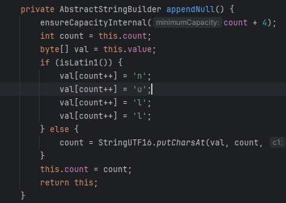​

‍

## StringBuilder

一个可变的字符序列。此类提供一个与String Buffer兼容的APl,但不保证同步(StringBuilder不是线程安全)。

‍

该类被设计用作StringBuffer的一个简易替换，用在字符串缓冲区被单个线程使用的时候。如果可能，建议优先采用该类因为在大多数实现中，它比StringBuffer要快。在StringBuilder上的主要操作是append和insert方法，可重载这些方法，以接受任意类型的数据。

‍

### stringBuilder 拼接字符串

> 拼接更高效更省资源，默认下tostring已经被重写 ，append方法的返回值是this就是s1对象，不仅是可以拼接传入的字符串，传入数字等都可以转换成字符串拼接，也有一些字符串方法, 可以用来输出数组（思路还是取出在拼接只是拼接的放啊变了），更优雅

```Java
public class api_stringBuilder {
    public static void main(String[] args) {
        StringBuilder s1=new StringBuilder();
        s1.append(1232);
        s1.append("sadasd");
  
        //默认下tostring已经被重写
        System.out.println(s1);
        //翻转字符串
        System.out.println(s1.reverse());
  
        StringBuilder s2=new StringBuilder();
  
        //支持链式调用
        s2.append("这个对象的方法，").append("return返回的都是this").append("所以可以继续调用");
        System.out.println(s2);
  
        //最终我们是要返回的是处理好的字符串，但是默认返回的还是对象类型，所以需要转化
         //转化为字符串
        s1.toString();
        s2.toString();
        //未转化前是StringBuilder对象类型
        System.out.println(s1);
        System.out.println(test(s1.toString()));
  
    }

}


```

> 原本的字符串拼接由于字符串是不可变的，所以每次拼接都是

​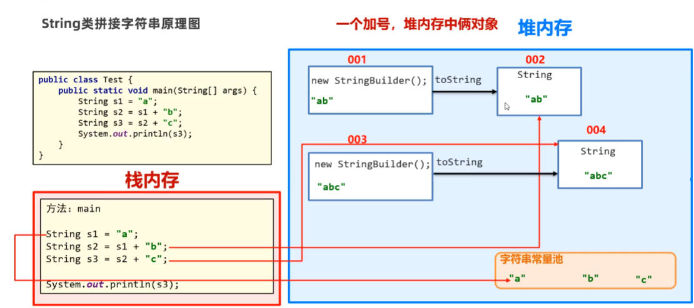​

‍

‍

‍

### String StringBuffer  StringBuilder三者对比

‍

StringBuilder和StringBuffer非常类似，均代表可变的字符序列，而且方法也一样

String:不可变字符序列，效率低，但是复用率高。

String Buffer:可变字符序列、效率较高（增删）、线程安全

StringBuilder:可变字符序列、效率最高、线程不安全

‍

使用的原则，结论：

1.如果字符串存在大量的修改操作，一般使用StringBuffer或StringBuilder

2.如果字符串存在大量的修改操作，并在单线程的情况，使用StringBuilder

3.如果字符串存在大量的修改操作，并在多线程的情况，使用StringBuffer

4.如果我们字符串很少修改，被多个对象引用，使用String,比如配置信息等

‍

## Math数学运算方法集合

> 提供取整，生成随机数等的数学方法，是工具类，静态方法不用实例化

```Java
  System.out.println(Math.random());
```

#### 算术运算

1. ​`Math.abs(a)`​：取a的绝对值
2. ​`Math.sqrt(a)`​：取a的平方根
3. ​`Math.cbrt(a)`​：取a的立方根
4. ​`Math.max(a,b)`​：取a、b之间的最大值
5. ​`Math.min(a,b)`​：取a、b之间的最小值
6. ​`Math.pow(a,b)`​：取a的b平方

#### 算术进位

1. ​`Math.ceil()`​​：逢余进一
2. ​`Math.floor()`​​：逢余舍一
3. ​`Math.rint()`​​：四舍五入
4. ​`Math.round()`​​：四舍五入

‍

## Arrays(数组)类

#### 快速输出数组元素

```Java
        int [] ar={123,456,789,16,3,13};
        System.out.println(Arrays.toString(ar));
```

#### 对数组排序

```Java
Arrays.sort(ar);
```

#### 二分法搜索

> 前提是把数组排好序 ,没拍好有也找不到, 返回该元素的位置，搜索速度更快

```Java
//                                     数组  元素 
 System.out.println(Arrays.binarySearch(ar, 123));
```

> 如果找不到该元素，则会返回  -1 减去假如有该插入的位置 ，

[3, 13, 16, 123, 456, 789]  假设找5    则返回 -2

```Java
System.out.println(Arrays.binarySearch(ar, 5));
》》》 -2
```

#### 自定义排序规则

自定义排序体现：接口编程+动态绑定+匿名内部类的综合使用

> 默认的排序是升序，通过修改比较器改变成降序或其他方式进行排序

```Java
        //修改数组排序方式，默认是升序，改成降序
        Integer[] arr2={123,456,8,6,456,31};
        //第二个参数是引用对象
        Arrays.sort(arr2, new Comparator<Integer>() {
            @Override
            public int compare(Integer o1, Integer o2) {
                return o2-o1;  //设置成降序
            } 
        });
        System.out.println(Arrays.toString(arr2));
```

‍

> return的值  ，大于时会调换前后顺序

​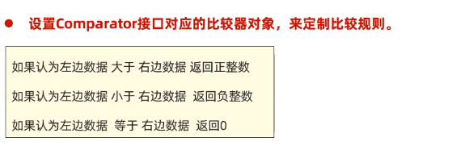​

‍

#### 源码解读

二分搜索来找到正确的位置，如果得出上面return根据值大小不同来返回不同排序。

```java
    private static <T> void binarySort(T[] a, int lo, int hi, int start,
                                       Comparator<? super T> c) {
        assert lo <= start && start <= hi;
        if (start == lo)
            start++;
        for ( ; start < hi; start++) {
            T pivot = a[start];

            // Set left (and right) to the index where a[start] (pivot) belongs
            int left = lo;
            int right = start;
            assert left <= right;
            /*
             * Invariants:
             *   pivot >= all in [lo, left).
             *   pivot <  all in [right, start).
             */
            while (left < right) {
                int mid = (left + right) >>> 1;
                if (c.compare(pivot, a[mid]) < 0)
                    right = mid;
                else
                    left = mid + 1;
            }
            assert left == right;

            /*
             * The invariants still hold: pivot >= all in [lo, left) and
             * pivot < all in [left, start), so pivot belongs at left.  Note
             * that if there are elements equal to pivot, left points to the
             * first slot after them -- that's why this sort is stable.
             * Slide elements over to make room for pivot.
             */
            int n = start - left;  // The number of elements to move
            // Switch is just an optimization for arraycopy in default case
            switch (n) {
                case 2:  a[left + 2] = a[left + 1];
                case 1:  a[left + 1] = a[left];
                         break;
                default: System.arraycopy(a, left, a, left + 1, n);
            }
            a[left] = pivot;
        }
    }
```

‍

> 实际应用时会用于排序一个对象内的某个值，年龄等

```Java
Double.compare(pa1,pa2);  //对比浮点数，前面减后面,可以设置成retrun
```

```Java
//排序对象的某个属性
    return o1.getAge-o2.getAge;  

```

‍

‍

## System系统类

> 静态工具类，功能通用

```Java
//关闭虚拟机，直接把代码嘎了一样
System.exit(0);

System.out.println();

//时间戳（毫秒 1970 1-1 00：00：00到目前）
  System.out.println(System.currentTimeMillis());

```

在Java中，`System.gc()`​是一个用来建议垃圾回收器（Garbage Collector, GC）进行垃圾回收的方法。垃圾回收是Java虚拟机（JVM）的一个特性，它自动管理内存，释放不再被使用的对象所占用的内存资源。

垃圾回收机制的工作原理基于以下几个基本概念：

1. **可达性分析**：垃圾回收器会确定哪些对象是“可达的”，即哪些对象仍然被程序中的活跃部分所引用。不可达的对象，即不再被引用的对象，被认为是垃圾，可以被回收。
2. **标记-清除（Mark-Sweep）** ：这是垃圾回收的一种常见策略，包括两个阶段：标记（标记所有可达的对象）和清除（删除所有未被标记的对象）。
3. **复制（Copying）** ：在新生代垃圾回收中常用的一种策略，将内存分为两个相等的部分，每次只使用其中一个。当进行垃圾回收时，将活动的对象从当前使用的部分复制到另一个部分，然后清理整个旧的部分。
4. **分代回收**：JVM通常采用分代回收的策略，将对象分为不同的“代”，通常是新生代（Young Generation）和老年代（Old Generation）。不同代的对象有不同的回收频率和策略。  
    ​`System.gc()`​方法的作用是提醒JVM，这是一个进行垃圾回收的好时机。但是，JVM并不保证会立即响应这个请求。在大多数情况下，现代JVM都非常智能，能够自动管理内存，因此不需要显式调用`System.gc()`​。  
    过度或不恰当地使用`System.gc()`​可能会导致性能问题，因为它可能会触发不必要的全堆垃圾回收，这会暂停应用程序的运行，并可能导致不必要的时间开销。  
    总之，`System.gc()`​是一个用于建议JVM进行垃圾回收的方法，但在大多数情况下，让JVM自己管理内存是更好的选择。

‍

## BigDecimal精度浮点运算

> 在java中某些浮点数的运算会失真，用BigDecimal解决该问题，先将浮点数包装成BigDecimal类型再调用其中的方法来运算

```Java
        System.out.println(0.1+0.2); 
        >>>0.30000000000000004
    
    
        import java.math.BigDecimal;
   public class api_BigDecimal {
    public static void main(String[] args) {
        double a=0.1;
        double b=0.2;
        System.out.println(0.1+0.2);
        //包装成BigDecimal对象
        BigDecimal a1=BigDecimal.valueOf(a);
        BigDecimal b1=BigDecimal.valueOf(b);
        //使用对象方法相加减
        System.out.println(a1.add(b1));
        System.out.println(a1.subtract(b1));
        System.out.println(a1.divide(b1));
        //把BigDecimal对象转化成浮点型，最终我们是想要处理好的double数据
        double a11= a1.doubleValue();


    }
}

```

> 📌BigDecimal一定是要用精度计算的，像10/3这种无尽的，就会报错，有解决方法

最后可以选择输出的方法，保留几位小数，向上向下取整等

​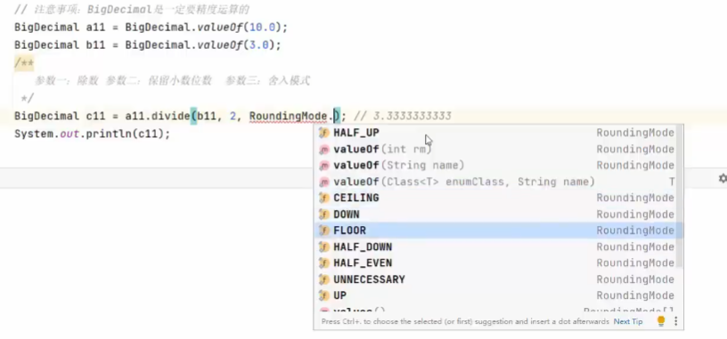​

‍

## `BigInteger`​精度浮点运算

​`BigInteger`​ 是 Java 中用于表示任意大整数的类。这个类可以用来表示非常大的整数，其范围远远超出了`int`​、`long`​等基本数据类型所能表示的范围。

​`BigInteger`​类提供了许多有用的方法来进行大整数的运算，如加法、减法、乘法、除法和模运算等。  
以下是一些关于`BigInteger`​类的关键点：

1. **不可变性**：`BigInteger`​对象一旦创建，其值就不能改变。
2. **范围**：`BigInteger`​可以表示任意大小的整数，没有上限。
3. **字面量**：你可以直接在代码中写出一个很大的`BigInteger`​字面量，例如：

    ```java
    BigInteger bigInt = new BigInteger("12345678901234567890123456789012345678901234567890");
    ```
4. **构造方法**：你可以通过多种方式创建`BigInteger`​对象，例如：

    * 使用`BigInteger(String val)`​，可以创建一个字符串表示的`BigInteger`​。
    * 使用`BigInteger(long val)`​，可以创建一个长整型表示的`BigInteger`​。
    * 使用`BigInteger(byte[] val)`​，可以创建一个字节数组表示的`BigInteger`​。
5. **方法**：`BigInteger`​类提供了丰富的方法来进行大整数的运算和转换，例如：

    * ​`add(BigInteger val)`​：加法。
    * ​`subtract(BigInteger val)`​：减法。
    * ​`multiply(BigInteger val)`​：乘法。
    * ​`divide(BigInteger val)`​：除法。
    * ​`mod(BigInteger val)`​：取模。
    * ​`pow(int exp)`​：幂运算。
6. **性能**：由于`BigInteger`​使用了高效的数据结构，因此进行大整数运算的速度相对较快。
7. **示例**：

    ```java
    BigInteger a = new BigInteger("1234567890123456789012345678901234567890");
    BigInteger b = new BigInteger("9876543210987654321098765432109876543210");
    // 加法
    BigInteger sum = a.add(b);
    System.out.println("Sum: " + sum);
    // 减法
    BigInteger diff = a.subtract(b);
    System.out.println("Difference: " + diff);
    // 乘法
    BigInteger product = a.multiply(b);
    System.out.println("Product: " + product);
    // 除法
    BigInteger quotient = a.divide(b);
    System.out.println("Quotient: " + quotient);
    // 取模
    BigInteger remainder = a.mod(b);
    System.out.println("Remainder: " + remainder);
    ```

​`BigInteger`​类在处理大整数运算时非常有用，特别是在加密和财务计算等领域。

‍

## 三代日期类

‍

### 第一代：Date时间API

> 实例对象

#### 获取当前时间

```Java
        Date t= new  Date();
        System.out.println(t);
    
        //获取时间戳（时间戳）
        System.out.println("时间戳"+t.getTime());
    
        //将时间毫秒转化为日期
         long t1=t.getTime();
         Date t2=new Date(t1);
        System.out.println(t2);
```

#### 格式化时间

> 把时间格式按照格式化的形式输出

```Java
        //格式顺序是固定的 EEE是星期几 ，a是上午或者下午按照当前时间来算
        SimpleDateFormat s=new SimpleDateFormat("yyyy年MM月dd日 HH:mm:ss EEE a");
	    SimpleDateFormat sdf2 = new SimpleDateFormat("yyyy年MM月dd日 HH:mm:ss E");
        SimpleDateFormat sdf3 = new SimpleDateFormat("yyyy-MM-dd; HH:mm:ss E");
        String s1=s.format(t);
        System.out.println("格式化时间:"+s1);
```

```Java
        //格式化时间也可以把时间毫秒转化成具体日期
        String s2=s.format(t.getTime());
        System.out.println("日期转换"+s2);
        //加十秒
         long s3= t.getTime()+10*1000;
        String s4=s.format(s3);
        System.out.println("加十秒"+s4);
```

#### 解析字符串时间成日期对象

> 传入的字符串要和定义的字符串形式一样 ，变的只是时间之间的符号 2022-10 2022/10

```Java
 //解析字符串时间成日期对象
        String str1="2023年1月5日 15:30:20";
        //转化字符串为对象.这里需要定义好传入的格式否则会无法识别
        SimpleDateFormat strtoobj=new SimpleDateFormat("yyyy年MM月dd日 HH:mm:ss");
        //转化成对象
        Date obj=strtoobj.parse(str1);
        //获取该对象换算的时间毫秒值  ,加上2天14小时49分06秒
        long time= obj.getTime()+(2L*24*60*60+ 14*60*60 +49*60+6)*1000;
        String time2=s.format(time);
        System.out.println("加上2天14小时49分06秒"+time2);
```

> 📌对整数的运算，java一般先会以int来计算，可能会超出int的范围所以加一个L识别成long

‍

### 第二代：Calendar

‍

​`Calendar`​ 类是 Java 中用于日期和时间操作的类之一。它为操作年、月、日、小时、分钟、秒和毫秒等日期字段提供了丰富的方法。

构造器

​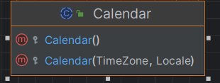​

​`Calendar`​ 类是一个抽象类，因此不能直接实例化，但你可以通过它的静态方法 `getInstance()`​ 来获取一个默认时区和语言环境的 `Calendar`​ 实例。

‍

以下是一些 `Calendar`​ 类的基本用法：

1. **获取当前日期和时间**：

    ```java
    Calendar calendar = Calendar.getInstance();
    ```
2. **设置特定的日期和时间**：

    ```java
    Calendar calendar = Calendar.getInstance();
    calendar.set(2023, Calendar.NOVEMBER, 8); // 设置为 2023年11月8日
    ```
3. **获取和修改日期字段**：

    ```java
    int year = calendar.get(Calendar.YEAR);
    int month = calendar.get(Calendar.MONTH); // 月份从0开始，所以11表示12月
    int day = calendar.get(Calendar.DAY_OF_MONTH);   //获取24小时制
    calendar.add(Calendar.DAY_OF_MONTH, 1); // 在当前日期上加一天
    ```
4. **日期和时间的格式化**：  
    通常，`Calendar`​ 对象与 `SimpleDateFormat`​ 类一起使用来格式化日期和时间。

    ```java
    SimpleDateFormat sdf = new SimpleDateFormat("yyyy-MM-dd HH:mm:ss");
    String formattedDate = sdf.format(calendar.getTime());
    ```
5. **时间转换**：  
    ​`Calendar`​ 可以将日期和时间转换为毫秒值，这是 Java 中的标准时间表示方式。

    ```java
    long timeInMillis = calendar.getTimeInMillis();
    ```
6. **时区和语言环境**：  
    你可以创建一个指定时区和语言环境的 `Calendar`​ 实例。

    ```java
    Calendar calendar = Calendar.getInstance(TimeZone.getTimeZone("UTC"), Locale.FRANCE);
    ```

‍

‍

### 第三代日期类：jkd8新增API

* LocalDate(日期/年月日)
* LocalTime(时间/时分秒)、
* LocalDateTime(日期时间/年月日时分秒）

这些新的日期时间类在设计上更加合理，提供了更多的灵活性，并且线程安全，因为它们都是不可变的。

​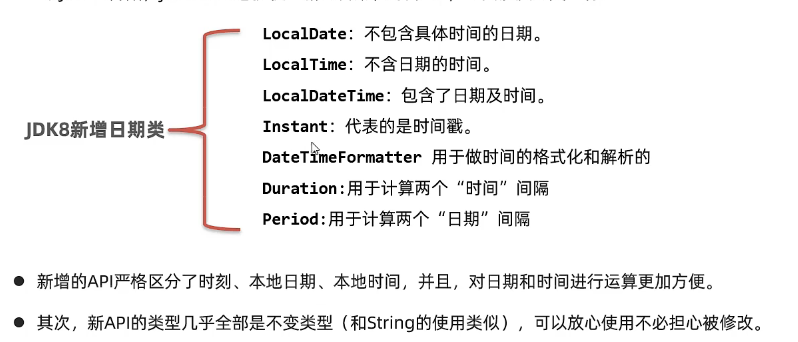​

​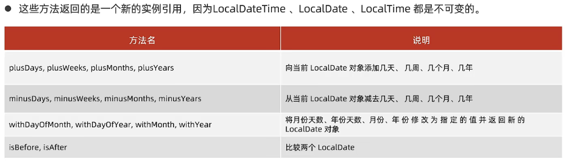​

‍

#### LocalDate

​`LocalDate`​ 类用于表示日期，它包含年、月和日的信息，但不包含时间或时区信息。以下是一些 `LocalDate`​ 的基本用法：

* **获取当前日期**：

  ```java
  LocalDate today = LocalDate.now();
  ```

#### LocalTime

​`LocalTime`​ 类用于表示时间，它包含小时、分钟、秒和纳秒的信息，但不包含日期或时区信息。以下是一些 `LocalTime`​ 的基本用法：

* **获取当前时间**：

  ```java
  LocalTime currentTime = LocalTime.now();
  ```

#### LocalDateTime （用这个）

​`LocalDateTime`​ 类是 `LocalDate`​ 和 `LocalTime`​ 的组合，它同时包含日期和时间信息，但不包含时区信息。以下是一些 `LocalDateTime`​ 的基本用法：

* **获取当前日期和时间**：

  ```java
          LocalDateTime ldt=LocalDateTime.now();
          System.out.println(ldt);

          System.out.println(ldt.getHour());
          System.out.println(ldt.getMinute());
          System.out.println(ldt.getSecond());
  ```
* **格式化日期时间**：

  ```java

          System.out.println("格式化后的日期");
          DateTimeFormatter formatter = DateTimeFormatter.ofPattern("yyyy-MM-dd HH:mm:ss");

          String t1=formatter.format(ldt);
          System.out.println(t1);
  ```

* 对时间进行前后进行计算

  ```java
  //        对当前时间进行加减，例如计算 会员到期时间
          LocalDateTime AfterOneMonth = ldt.plusDays(31);
          LocalDateTime BeforeOneMonth = ldt.minusDays(31);
          System.out.println("当前时间是"+ldt);
          System.out.println("一个月后和一个月前");
  //        格式化后在输出
          String s1=formatter.format(AfterOneMonth);
          System.out.println(t1);
          String s2=formatter.format(BeforeOneMonth);
          System.out.println(s2);
  ```

‍

‍

Period 计算出日期之间的差值

```Java

```

​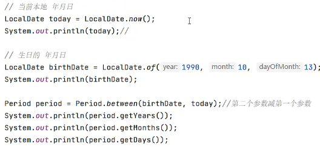​

Duration计算两个时间的具体差

> 计算包括 天数 小时数 分钟数 毫秒

​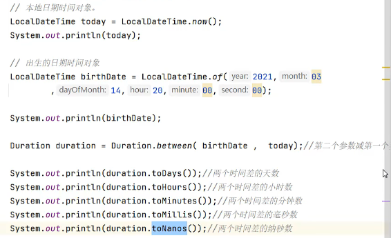​

ChronnoUnit最全时间差工具类

​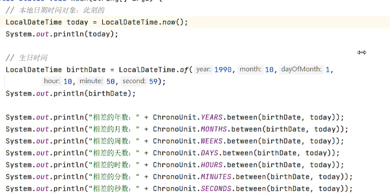​

‍

‍

# 集合

Java集合框架是Java编程语言中一个强大的工具箱，它提供了多种数据结构来高效地管理和操作对象集合。集合框架位于`java.util`​包中，并且它的设计遵循了统一的接口规范，使得开发者可以根据具体需求选择合适的实现类

* **线程安全**：Java集合框架中的大部分实现类默认不是线程安全的。若要在多线程环境中安全使用，可以考虑使用`Collections.synchronizedXxx()`​方法包装，或者使用`java.util.concurrent`​包下的并发集合，如`ConcurrentHashMap`​、`CopyOnWriteArrayList`​等。
* **迭代器**：所有集合类都可以通过`iterator()`​方法获取迭代器进行遍历，迭代过程中支持`remove()`​方法移除当前迭代项。
* **泛型**：Java集合框架全面支持泛型，可以在编译时确保集合内元素的类型一致，提高程序的类型安全性。
* **流(Streams)** ：Java 8引入了Stream API，它可以与集合无缝配合，提供更高级的函数式编程风格的数据处理能力。

集合对比数组的优点：

> 集合是存储对象数据的一种容器。集合非常适合做元素的增删操作。

1. 数组和集合的元素存储的**个数问题。**

    数组定义后类型确定，长度固定

    **集合类型可以不固定，大小是可变的。**

2. 数组和集合存储元素的**类型问题。**

    数组可以存储基本类型和引用类型的数据。

    **集合只能存储引用数据类型的数据。**

3. 数组和集合适合的场景

    数组适合做数据个数和类型确定的场景。

    **集合适合做数据个数不确定，且要做增删元素的场景。**

‍

## 接口层次

​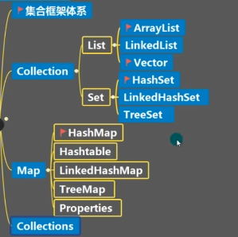​

#### - `java.util.Collection`​

这是所有集合类的根接口，它代表一组对象。Collection有两个直接子接口：

* ​`java.util.List`​: 有序（可重复）、元素可以通过索引访问的集合，如`ArrayList`​、`LinkedList`​等。
* ​`java.util.Set`​: 不允许重复元素（每个元素都是唯一的），无序集合，如`HashSet`​、`LinkedHashSet`​和`TreeSet`​。

#### - `java.util.Map`​

不同于集合，Map是一个键值对的集合，它维护的是键到值的映射关系，不继承自Collection，但与之并列。常见的实现类有`HashMap`​、`TreeMap`​和`LinkedHashMap`​等。

‍

### 集合类体系结构

> Collection单列集合，每个元素（数据）只包含一个值。  
> Map双列集合，每个元素包含两个值（键值对）。

​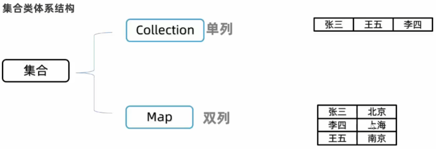​

单列与双良

​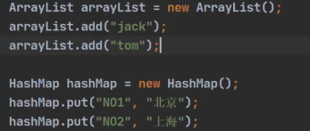​

Collection体系

都是基于Iterable接口实现的，所以collection接口下都可以使用**迭代器**

​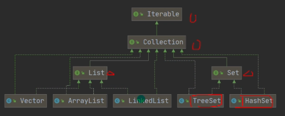​

‍

map体系

​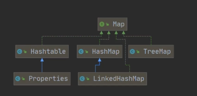​

‍

‍

## Collection集合

* List系列集合：添加的元素是有序、可重复、有索引。

  **ArrayList**、LinekdList:有序、可重复、有索引

* Set系列集合：添加的元素是无序、不重复、无索引。  

  ◆HashSet:无序、不重复、无索引；LinkedHashSet::有序、不重复、无索引。  
  ◆TreeSet:按照大小默认升序排序、不重复、无索引。

​​

### Collection->List

#### **ArrayList (重点)**

实例化对象并使用常见的方法

```java
        List list=new ArrayList();
```

* 添加元素

  ```java

       
  		//添加单个
  	    list.add("beidao");
          list.add('d');
          list.add(213);
          list.add(true);

  		//添加多个


          System.out.println(list);
  ```

  添加的内容 Object就是泛型，可以添加任意类型的数据

  添加多个时，只要是实现了collectinn接口的集合都可以直接添加一整个集合进去。

  ​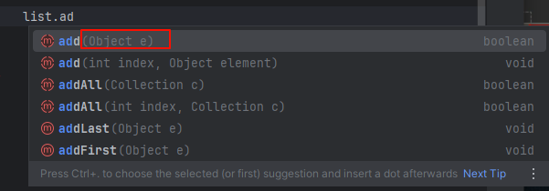​

* 删除元素（如果有多个就会先删除且只删除索引值小的）

  ```java
  	//        删除单个元素
          list.remove(true);
          list.remove(1);

          System.out.println(list);
  ```

  一种是通过元素值去移除，一种是通过索引值。

  ​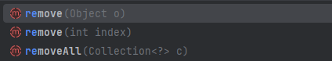​

* contains 查找元素是否存在。

  ```java
  ```

‍

#### LinekdList

‍

## Map集合

‍

‍

# JDK8

‍

## Lambd表达式

> jdk8之后的新语法，作用是简化匿名内部类代码的写法只能简化接口中只有一个抽象方法的医名内部类形式，后续较为常用

什么是函数式接▣？
首先必须是接口、其次接口中有且仅有一个抽象方法的形式
●通常我们会在接口上加上一个@Functionallnterface:注解，标记该接口必须是满足函数式接口。

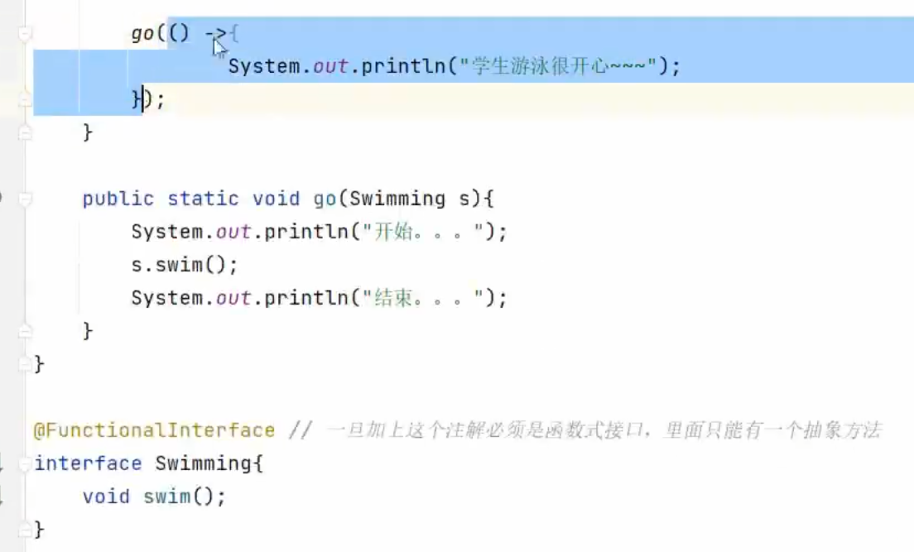

简化的是new新对象的过程和重写方法的过程，直接调用内部的方法即可，

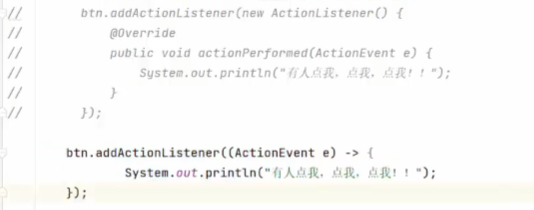

#### 省略规则


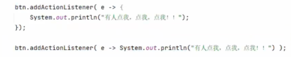

‍
